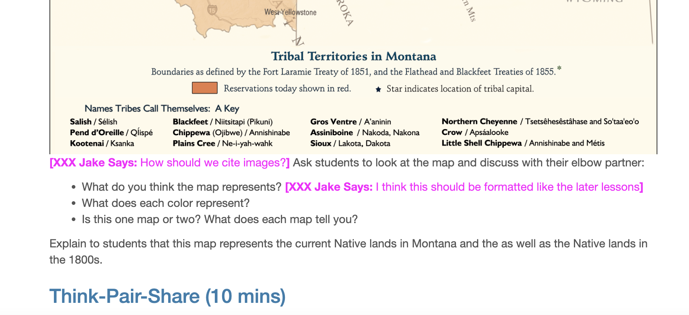
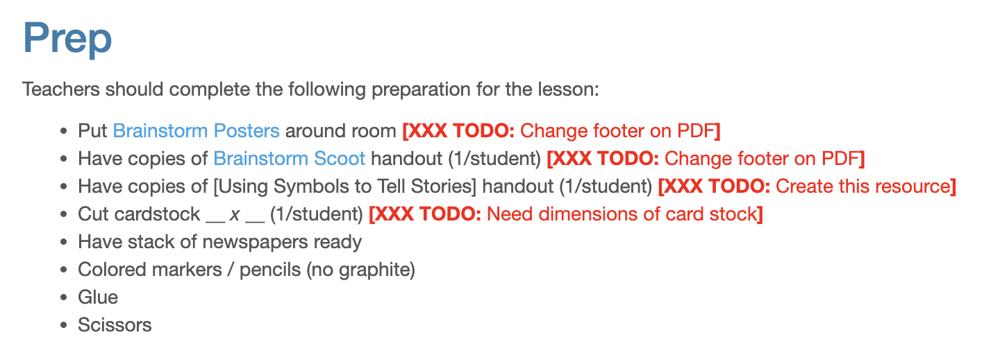

# Standards of Practice

## Getting Started
To edit the lessons in this curriculum, go to the [lessons folder](./_docs/lessons/). To preview changes, [go to the website](https://montanastorytelling.github.io/ledger-art/) (changes may take up to a minute; you may need to refresh). It is recommended that you have both open in separate tabs. In order for your edits to appear on the site, you need to commit and push changes. For ease of use, do not create branches; using the main branch is sufficient.

## Member Comments
To add yourself as a member who can comment:
- Go to [main.scss](./assets/css/main.scss)
- At the bottom of the page, add the following code:
```
.name {
  color: YourColor;
  &:before {
    font-weight: bold;
    content: "[XXX Name Says: ";
  }
  &:after {
    font-weight: bold;
    content: "]";
  }
}
```
- Change name to your first name both in the class name and the content. Change YourColor to magenta if you are faculty or orange if you are a student.

To make a comment in line, write the following code:
```
<span class="name">Your comment</span>
```
It will look as follows:

## Using TODOs Inline
To create a todo in the text, add the following code:
```
<span class="todo">The TODO text</span>
```
TODOs will appear as follows:

## Adding and Inserting an Image
When adding an image, add the file to the folder:
```
/_docs/resources/images/
```
and name the file PART-LESSON_IMAGE-NAME.EXTENSION (e.g. 2-1_cpx-diagram.png)

When inserting an image for lesson guides, use the code:
```

```

## Adding and Linking a Local Resource
When adding a local resource, add the file to the folder:
```
/_docs/resources/
```
and name the file PART-LESSON_FILE-NAME.PDF (e.g. 2-1_intro-to-programming.pdf).

When linking a local resource, use the code:
```
[Resource Title](../resources/FILENAME)
```

## Editing Lessons
Do not touch the yml code on lines 1-4.  
On line 5, begin all lessons with Subject as header 2 (header 1 is inherited from the page title).

All lessons have the following header structure:
| Header | Header Name |
| ------ | ----------- |
| 2 | Subject |
| 2 | Grade Level |
| 2 | Established Goal(s)/Target(s) |
| 2 | Montana Standards |
| 2 | Evidence of Learning |
| 2 | Prep |
| 2 | Vocabulary |
| 2 | Lesson Guide |
| 3 | Activity 1 |
| 3 | Activity 2 |
| 3 | etc. |

## Formatting Lessons
Use the following formatting guidelines for content in lessons:
| Content | Formatting |
| ------- | ---------- |
| Grade Level | 4/5 |
| Standards | Bullet points, underline numerical code |
| Evidence of Learning | Bullet points |
| Prep | Bullet points |
| Vocabulary | Markdown definitions |
| Think-Pair-Share prompts | Markdown quoted text |
| Vocabulary words | 2 column table; term in bold, definition plain text |
| Names of files | Italics |
| Keywords for tech guides | Italics |
| Names of MakeCode blocks | Italics |

# TODO

## Curriculum Enhancement
- [ ] 3-1
  - [X] Add visual arts standards
  - [X] Create scaffold for creating symbolism in stories
  - [ ] Need card stock dimensions
  - [X] Change footer on Brainstorm Posters
  - [X] Change footer on Brainstorm Scoot
- [ ] 3-2
  - [X] Add visual arts standards
  - [ ] Create example Ledger Art Projects

## User Experience
- [X] /_docs/index.md
  - [X] Create a big picture summary of the curriculum and the connections made.
- [X] Add and link transcripts to all videos

## Content Transfer
For each lesson,
- Copy and format content from MS Word
- Save all resources as pdf and add to _docs/resources
  - Use same file name as in SharePoint
- Save lesson plan images in _docs/resources/images/
  - File name should be PART-LESSON_DESCRIPTOR1-DESCRIPTOR2.EXTENSION (e.g. 2-2_cat-circuit.png)
- Link the image in the .md file
- Check all links
- [X] 1-1
- [X] 1-2
- [X] 2-1
- [X] 2-2
- [ ] 3-1 (needs card stock dimensions)
- [ ] 3-2 (needs examples of ledger art projects)
- [X] 3-3
- [X] 4-1
- [X] 4-2
- [X] 4-3
- [X] 5-1
- [X] 5-2
- [X] 5-3
