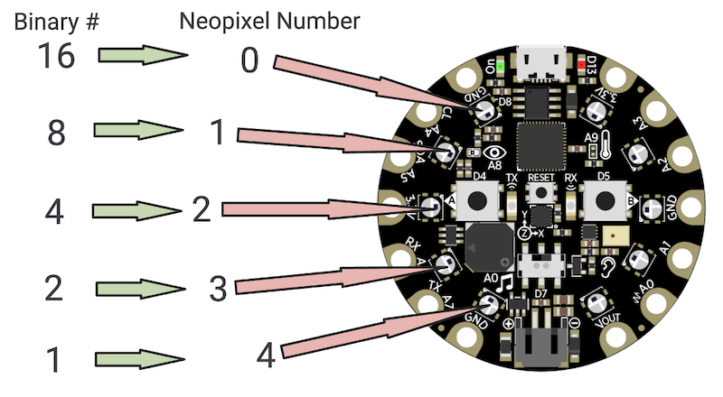
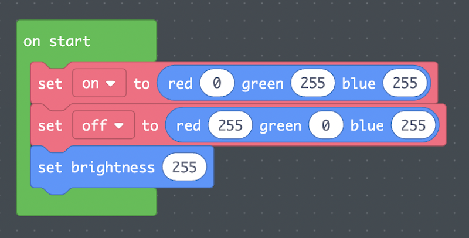
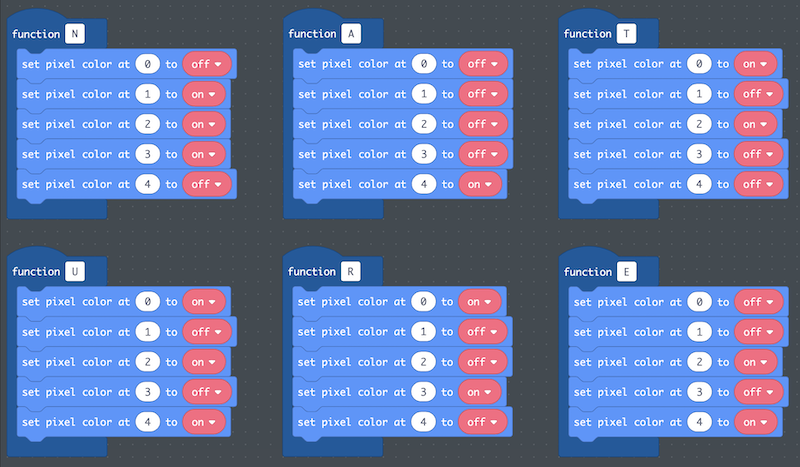
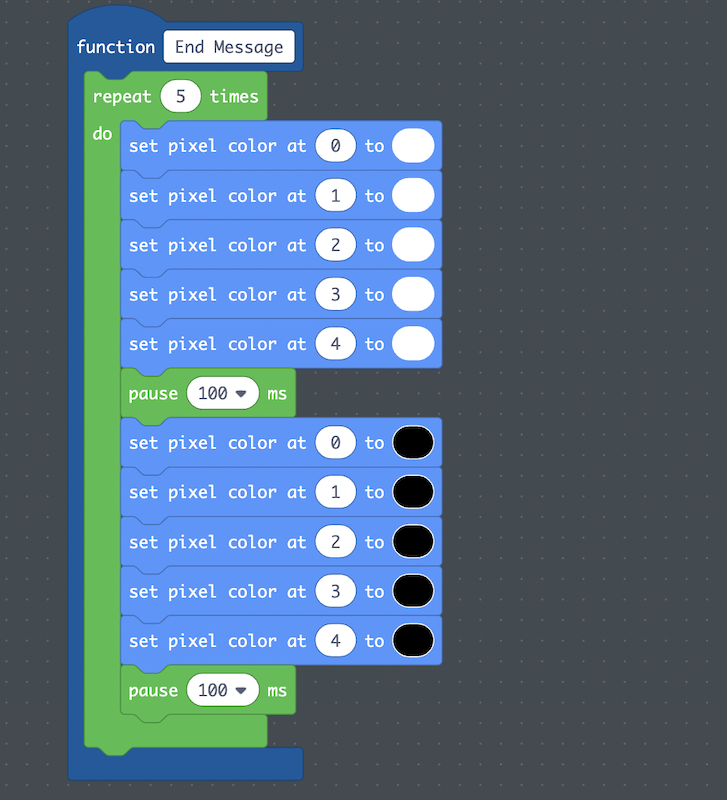
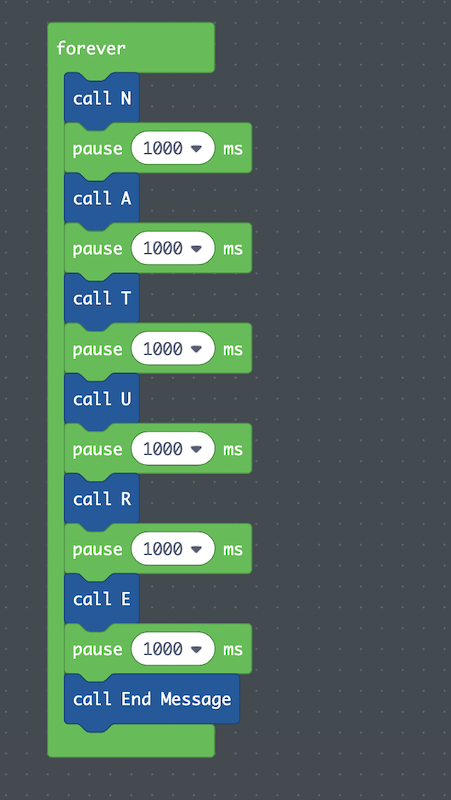
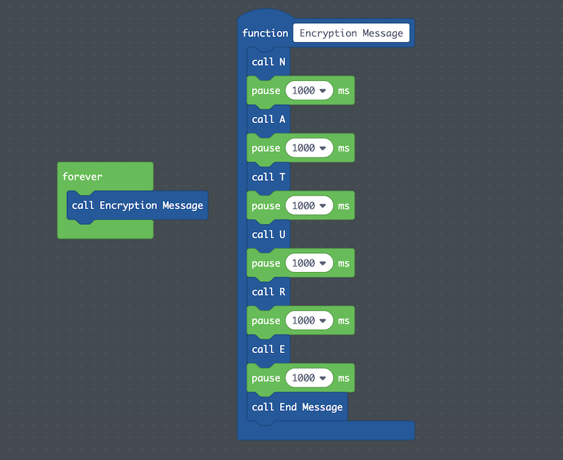

## Table of Contents
- [1 Overview](#overview)
- [2 Plan](#plan)
- [3 Program](#program)

## 1 Overview 
By the end of section three, students have constructed the Ledger Art Project.
In lesson [4-1 (Binary)](../4-1/), students learn binary and develop a communication
protocol that maps the letters of the alphabet to decimal and then binary. In
lesson [4-2 (Encryption)](../4-2/), students use their binary communication
protocol to create an encryption technique and add an encrypted message on their
Ledger Art Project.

The Encryption Project is from [4-2 (Encryption)](../4-2/), and uses five of the
NeoPixels on the Circuit Playground Express to represent a 5-bit binary number.
This guide will build on the Ledger Art Project described in the
[Ledger Art Project Guide](../ledgerguide/), and will be written in the first
person to make visible the design and computational decisions made in this
individual project.

## 2 Plan 
In order to create a 5-bit encryption for my message, I first needed to map the
letters of the alphabet to decimal numbers. I filled out the
[Binary Communication Protocol](../guides/guide-resources/enc-4-1_binary-communication-protocol.pdf)
from [4-1 (Binary)](../4-1). In my protocol,
I decided to make *A = 1*, *B = 2*, *C = 3*, ... , *Z = 26*.

I then needed a message to send. Since my Ledger Art Project is built around the
idea of being in nature, I chose **nature** as the message I wanted to send using
the NeoPixels on the Circuit Playground Express.

Using the NeoPixel guide in [4-1 (Binary)](../4-1/),

I then [storyboarded the code](../guides/guide-resources/enc-4-2_program-name.pdf)
using the student handout from [4-2 (Encryption)](../4-2/) to make my message:

|     Letter    |     Decimal    |     Binary    |     NeoPixel Pin State                              |
|--------------:|---------------:|:-------------:|-----------------------------------------------------|
|     N         |     14         |     01110     |     0 OFF     1 ON     2 ON     3 ON     4 OFF      |
|     A         |     1          |     00001     |     0 OFF     1 OFF     2 OFF     3 OFF     4 ON    |
|     T         |     20         |     10100     |     0 ON     1 OFF     2 ON     3 OFF     4 OFF     |
|     U         |     21         |     10101     |     0 ON     1 OFF     2 ON     3 OFF     4 ON      |
|     R         |     18         |     10010     |     0 ON     1 OFF     2 OFF     3 ON     4 OFF     |
|     E         |     5          |     00101     |     0 OFF     1 OFF     2 ON     3 OFF     4 ON     |

I was now ready to begin coding my project.

## 3 Program 
Since NeoPixels have data stored for their brightness and color, I first created
an *on start* block to initialize the colors I will use in variables and set the
brightness to 255 (full brightness). I created a variable called *on* to represent
a NeoPixel (bit) being on and a variable called *off* to represent a NeoPixel (bit)
being off. I decided to make the color cyan on and the color magenta off.

Having my variables set up, I decided to turn each letter into its own function.
In this way, I could iteratively and sequentially test each letter on my Circuit
Playground Express.

Having tested my code, I realized that it would be very difficult to know when the
message starts and ends. So I created a function that has all five NeoPixels flash
white at the end of the message.

At this point, I was ready to put it all together. I made a forever block and
called each of the letter functions with a one second pause between them. I ended
the message with the *End Message* function.

In order to clean up my code a little, I created a new function called *Encryption Message*
and put all the code in there. Then my *forever* loop only had one line of code in it.

I downloaded the code to my Circuit Playground one last time, and this is the
result!

