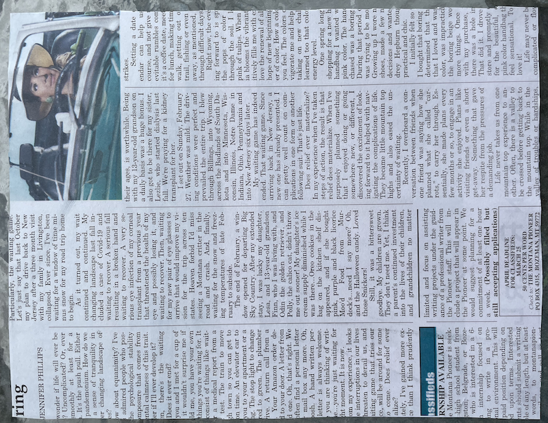
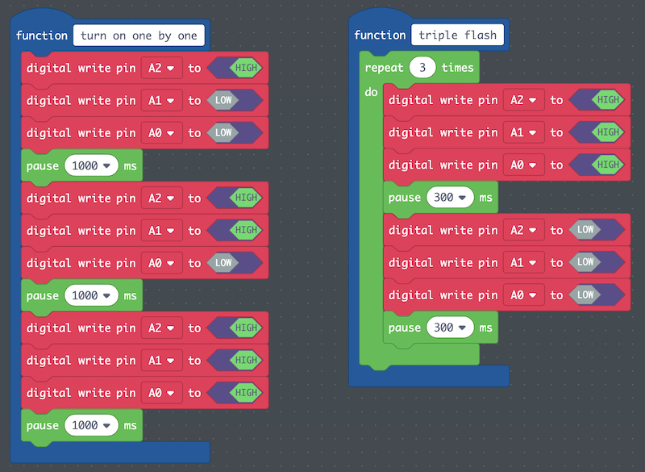
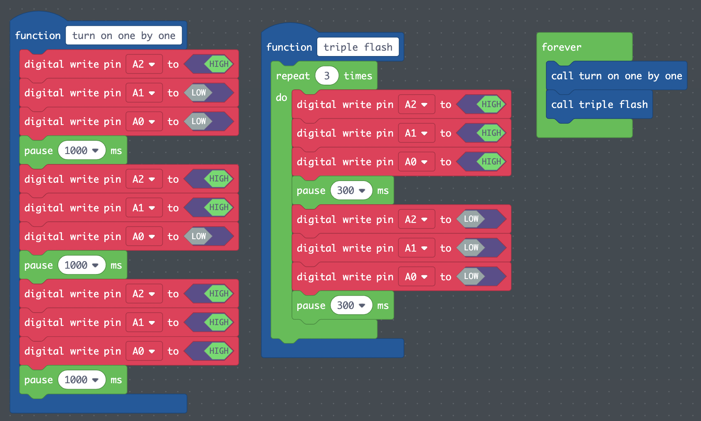

## Table of Contents
- [1 Overview](#overview)
- [2 Plan](#plan)
- [3 Design](#design)
  - [Visual Narrative](#visualnarrative)
  - [Circuit Diagram](#circuitdiagram)
  - [Code](#designcode)
- [4 Program](#program)

## 1 Overview <a name="overview"></a>
In section one of the curriculum, students learn about ledger art, and in section
two, students play with circuits. In section three, students combine ledger art
with circuitry as they plan, design, and program ledger art inspired projects.

This guide will present the process of creating the section 3 ledger art project
using an example made by one of the authors of the curriculum. The guide will be
written in the first person to emphasize design choices made by the creator and
how those choices influenced the practice of computing.

## 2 Plan <a name="plan"></a>
First, I brainstormed stories that I wanted to share with others. Growing up
in Los Angeles, my constant environment was a concrete jungle. In 5th grade, my
class took a trip to Yosemite, where we camped and hiked for a week. This experience
changed my world view and my connection with the Earth. I decided to build a
visual narrative to tell the story of my first camping trip in Yosemite.

I [completed the handout](../guides/guide-resources/lap-3-1_telling-stories-with-symbols.pdf)
from [3-1 (Introduce the Ledger Art Project)](../3-1). I chose the following
symbols to help visually tell my story:

| Symbol | Meaning |
| -----: | ------- |
| Backpack | Hiking in the outdoors and feeling a new connection with the land |
| Tent and tree | Sleeping in the outdoors |
| Open circle around me | Feeling a sense of vulnerability |
| Sun with rays | Feeling a sense of wonder and awe |
| Maze | Finding a new sense of self within a new place and experience |
| Earth | Environmentalism; taking care of our home |

I knew that I would need to select three of these images to highlight using
LEDs. I chose the following symbols and explain my reasoning:

| Symbol | Importance to the story |
| -----: | ----------------------- |
| Tent | Sleeping in a tent in the outdoors made me vulnerable and open to my new environment. |
| Maze | Feeling disoriented, I tried to find a new sense of self within this scary and larger place.  |
| Earth | The outcome of this experience is a lifelong dedication to environmentalism and protecting the only home we have.  |

At this point, I was ready to begin designing.

## 3 Design <a name="design"></a>
There were two parts to designing my ledger art project: drawing my visual
narrative and creating a circuit diagram on top of the visual narrative.

### Visual Narrative <a name="visualnarrative"></a>
I cut out a large piece of newspaper and glued it to card stock measuring 8.5" x
11". I then trimmed the excess newspaper to fit the card stock.



I added the symbols that I planned out on top of the newspaper.


### Circuit Diagram <a name="circuitdiagram"></a>
Now that the visual narrative was complete, I wanted a way to add three LEDs to
the visual narrative so that I could control each of the three LEDs individually.
This would mean that I would need to connect the positives of each LED to a different
pin on the Circuit Playground.

I put tracing paper over my visual narrative so as not to have to start over if
I made a mistake. I started by drawing where I wanted the three LEDs to be
placed. I then decided that I wanted all of my lines to go to the bottom of the
paper so that I can connect the circuit playground at the bottom. To further
simplify the circuit design, I drew the positive lines first. I decided to make
the positive sides of the LEDs face down because I figured that the positive lines
would be most difficult to orient since they were being connected to three different
pins, while the negative lines could all be connected to the same ground.


I knew that negative lines cannot cross positive lines. So my negative lines would
have to go above the LEDs and around on the right. I made the decision to have
one continuous line connect all of the negatives of the LEDs and then go to ground
on the Circuit Playground Express. I made certain that I identified which lines
were positive by using red, and which were negative by using blue. I also indicated
polarity using a + and - on the drawing.


I then removed the tracing paper, and added my LEDs and copper tape to the
visual narrative as depicted in my circuit diagram.


### Code <a name="designcode"></a>
Before programming, I [storyboarded my light pattern](../guides/guide-resources/lap-3-2_storyboard-ledger.pdf)
using the student handout from [3-2 (Design the Ledger Art Project)](../3-2/).
In order to tell the story of how this was a sequential process, starting with
the environment, and ending with my feelings about that environment, I wanted my
LEDs to tell the story of how the three symbols are intertwined and caused by each
other.
```
tent on, maze and earth off.
pause 1 second.
tent and maze on, earth off.
pause 1 second.
tent, maze, and earth on.
pause 1 second.
tent, maze, and earth flash quickly three times.
repeat.
```
## 4 Program <a name="program"></a>
I wanted to be able to test my code. So I connected each of the positive lines
connected to the LEDs to the following pins:

| LED | Positive connected to pin # |
| ---: | -------------------------- |
| Tent | A2  |
| Maze | A1  |
| Earth  | A0  |

I connected the negative line to GND (ground).


I wanted to be able to iteratively and sequentially test my code. So I decided
to use functions and break up my light pattern into smaller pieces so that I
could test them individually:

| Function name | What it does |
| ------------: | ------------ |
|  *turn on one by one*  | A2 on, A1 and A0 off. pause 1 second. A2 and A1 on, A0 off. pause 1 second. A2, A1, and A0 on. pause 1 second.  |
| *triple flash*  | repeat x 3 {A2, A1, A0 on. pause .3 seconds. A2, A1, A0 off. pause .3 seconds} |



I tested both functions and the LEDs did what I wanted them to do! If they had not,
I would have had to debug and find where I made an error in my logic.

I then made a *forever* loop and called the two functions I made.



I performed one final test, and was very happy with the results. Here is my final
ledger art project.

<span class="todo">Insert video of working project</span>


