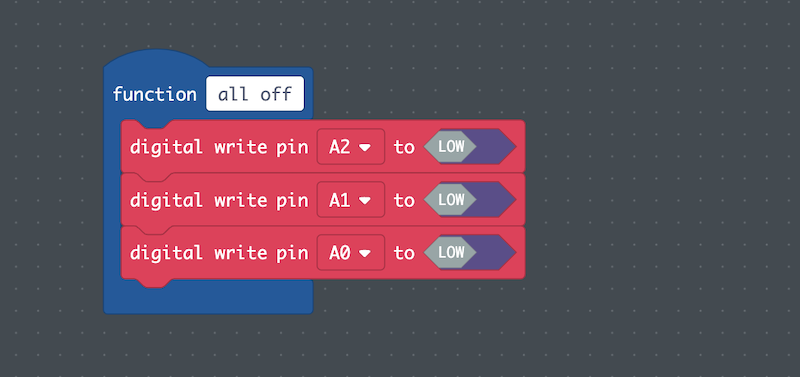
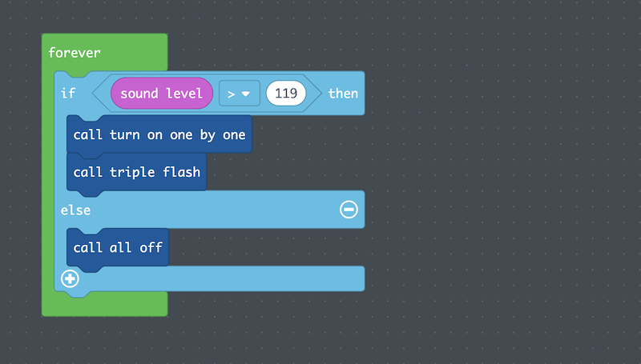

## Table of Contents

- [1 Overview](#overview)
- [2 Data Collection](#data)
- [3 Program](#program)

## 1 Overview <a name="overview"></a>
After section four, students will have created their Ledger Art Projects
and added an encrypted message on top of their visual narratives during the Encryption
Project. In [5-2 (Human-Computer Interaction)](../5-2/),
students will add the final addition to their computational artifact: initiating
their Ledger Art Project light patterns with their voices (the Encryption Project will not be affected).
Students will add code so that when they
tell their story, the individual LEDs connected by copper tape will light up, and
when they are not talking, the LEDs will not turn on.

This guide will add to the narrative started in the [Ledger Art Project Guide](../ledgerguide/)
and the [Encryption Project Guide](../encryptionguide/).

## 2 Data Collection <a name="data"></a>
In order to activate my Ledger Art Project with my voice, I needed to use the
microphone on the Circuit Playground Express. The microphone is a sensor that
"hears" the loudness of sound entering the sensor. MakeCode stores the readings
from the microphone in a variable called *sound level*. *sound level* is an integer
from 0 (quiet) to 255 (loud).

I considered some of the questions I had before beginning:
- What is the *sound level* of me telling a story?
  - Does *sound level* change while I tell a story or is *sound level* one value throughout?
- Does the distance of the Circuit Playground Express from my mouth affect *sound level*?
- Does environment affect *sound level*?
- What if someone else wants to use my project? Will someone else have the same *sound level* as me?

In order to answer these questions, I had to collect data. For the purposes of this
project, I decided to simplify my inquiry and focus on two variables:
1. Distance between the CPX and the speaker's mouth
2. The person speaking

I hypothesized that while telling a story, *sound level* was probably not going to
remain constant; *sound level* would most likely be a range of values, and that range
might change based on either the distance away from the speaker's mouth as well as
who is speaking. Since a range can be defined by its minimum and maximum values,
I decided to collect the lowest and highest values of *sound sensor* at various
distances and from various speakers. Because everyone speaks at different volumes
in different situations, I decided to tell the paricipants to tell a story as if
they were in a classroom before class begins; that is, speak at a volume as if you
are speaking to someone in the near area (1-5 seats away) in a classroom sized room.

I wrote some code that would print out the current *sound level* to the console.


I collected data from my family and friends. *Close* was defined as placing the
CPX next to the speaker's mouth, *average* was defined as average talking distance
from another person, and *far* was defined as about 15-20 feet away.

| Participant     |    Close: Lowest    |     Close: Highest    |     Average: Lowest    |     Average: Highest    |     Far: Lowest    |     Far: Highest    |
|----------------:|---------------------|-----------------------|------------------------|-------------------------|--------------------|---------------------|
|     Me          |     45              |     187               |     41                 |     153                 |     45             |     116             |
|     Alex        |     97              |     178               |     95                 |     163                 |     96             |     125             |
|     Jamie       |     51              |     155               |     51                 |     143                 |     51             |     120             |
|     Fernanda    |     53              |     192               |     53                 |     179                 |     52             |     154             |
|     Sue         |     45              |     185               |     42                 |     169                 |     45             |     122             |

Because there are times during a story when the speaker pauses, the lowest values
reflected the noise level of the environment where the data was collected. Because
of this, I knew that the loudest environment was collected by Alex with a value
of 97, and we were on a busy street. The lowest value was collected by me with a
value of 116, and that was far away from my mouth. I felt that if the value of
*sound level* is at least 120, there would be no chance of background noises
interfering with the storytelling, and all participants would be able to use the
product.

## 3 Program <a name="program"></a>
I then planned my code. I first wrote out in words what I wanted my code to do:
```
if the sound level is greater than 119, then run my light patterns.
else turn all the leds off.
```
I knew that I needed to tell the computer to turn off the LEDs if *sound level* is
less than 120 because my code is in a *forever* block, and unless the computer is
specifically told to turn the LEDs off, they will not turn off. This is because
my Ledger Art Project LEDs are controlled by the *digital write* block, which
only updates if it is called again. Since I only want
the project to run when I am telling my story, I needed to add this code.

At this point, I did not have a way to turn off the Ledger Art Project LEDs.
So I created a function that would turn off all of the LEDs.



I was now ready to plan out my pseudocode:
```
forever:
  if(sound level > 119):
    call turn on one by one
    call triple flash
  else
    call all off
```
I changed the *forever* block from my initial Ledger Art Project to reflect the
pseucode above.



I then tested my project, and it worked! Others were also able to use my project!
