## Table of Contents
- [1 MakeCode](#makecode)
  - [Saving and Sharing Projects](#shareproject)
  - [Connecting the Circuit Playground Express to MakeCode](#cpx-makecode)
  - [Managing Projects](#projects)
- [2 Circuits](#circuits)
  - [Tips for Using Copper Tape](#copper)
  - [Tips for Using LEDs](#led)
- [3 Circuit Playground Express](#cpx)
  - [Output Pins](#pins)
  - [NeoPixels](#neopixels)
  - [Input](#input)
  - [Speaker](#speaker)

## 1 MakeCode 
[MakeCode](https://makecode.adafruit.com/) is a free, web-based coding platform
that uses drag-and-drop blocks to scaffold learning. Students will create accounts
in MakeCode and can save their projects. Projects can be duplicated, edited,
and shared with others. After coding a project, students can download their code
from MakeCode into the Circuit Playground Express to run on their projects.

### Saving and Sharing Projects 
There are no accounts in MakeCode, which means that saved projects are not attached to a student's individual account. But this does not mean that students cannot save and share their projects.

When inside of a project on MakeCode, there is a button in the top left corner of the browser window called "Share." Clicking "Share" will prompt a window that asks the user to name and publish their project. In order to save and share a project for later, a project must first be named and published. Any modifications made to the project after it is published will NOT be reflected in the shared link so if a student makes edits to a project after they have named and shared it, the project must be named and published again and they will get a different link to a new project. This allows us to create versions of projects (if you want students to learn about version control).

When students share and publish their code, they will get a link to that particular
version of their project. It is strongly recommended that students copy and paste
that link into a file that is compatible with the learning management system used
by the teacher. For example, students can create a database of projects links in
a Google Doc, text file, word processing file, etc. Students should add information
for each link such as the project name, date, changes made, etc.

### Connecting the Circuit PlayGround Express to MakeCode 
Connecting the Circuit Playground Express (CPX) to MakeCode has been simplified
compared to previous versions of the Circuit Playground such as the Classic.

To connect, follow these steps:
1. Open [MakeCode](https://makecode.adafruit.com/) in Chrome and open or create a new project.
2. Connect the CPX to the computer via USB.
3. Press the *reset* button on the CPX to enter Bootloader Mode. The NeoPixels should turn red briefly followed by contiuous green. If the NeoPixels stay red, your operating system is still installing drivers, and you may need to wait a minute. If the red continues, try using a different USB; the connection may be bad.
4. Click on the gear in the top right, and click "Pair Device."
5. You should see a device called CPLAYEXPRESS or similar. Click on the device name and click "connect."
6. To download the code onto the CPX, click "Download" below the simulator on the left.

### Managing Projects 
To create a new project, go the MakeCode home screen, and click "New Project."

To share a project, click on "share" in the top left of the project. You will need
to name the project and then click "Publish Project." Copy the link to the project,
and store that link in a file with information about the project (see [Saving and Sharing Projects](#shareproject)).

To edit a project, you need the shared link to that project. Open the link, and
then click "edit" at the top. This is a duplicated project, and when shared, will
yield a different link from the original. This allows us to create versions of our
projects.

## 2 Circuits 
The materials we use to create circuits in this curriculum include:
- **copper tape** as an insulator
- **LEDs** for light patterns
- **Circuit Playground Express** as a power source with computational functionality.

### Tips for Using Copper Tape 
To use the copper tape, peel off the white paper on the back and run a finger
done the tape to secure it to a surface so it is straight and flush against the
surface. When connecting to an LED, secure firmly over the LED to tape it down.

The copper tape we use is conductive on both sides. Although it is highly
recommended that students use a single piece of copper tape for each of the lines on their
circuit, it is not necessary. As long as the connection between multiple strips
of tape is strong, the current should flow between multiple strips due to the
tape's double-sided conductivity. If a students' project uses multiple strips,
and the LEDs are not turning on, it could be a weak connection between the strips.
This is why it is highly recommended that students use a single piece of tape
for each of their lines.

Because a single piece of tape is recommended, students will need to create corners
with their tape to accommodate their circuit diagrams. To change the direction
of the copper tape, first start with some tape on the paper.

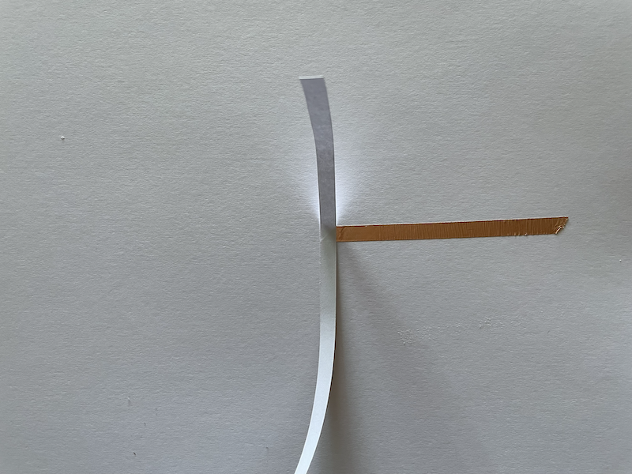

Then fold the tape down in the opposite direction you want to go, and crease the
tape so it is flush with the paper.

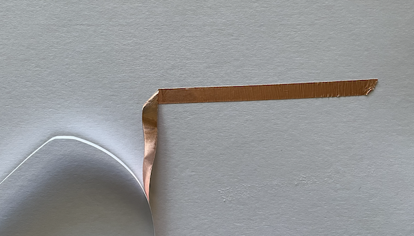

Fold the tape over itself in the direction you want to go and continue your lines.

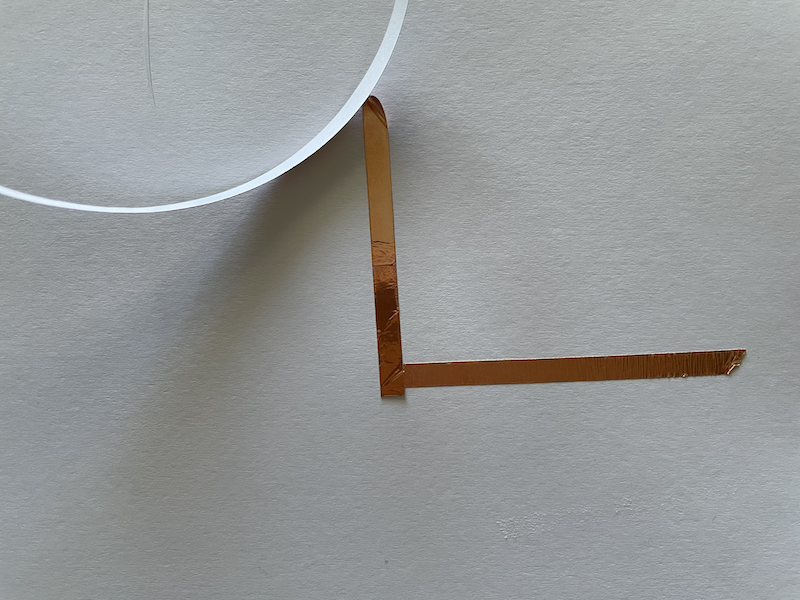

You can make as many corners as you like with a single piece of tape.

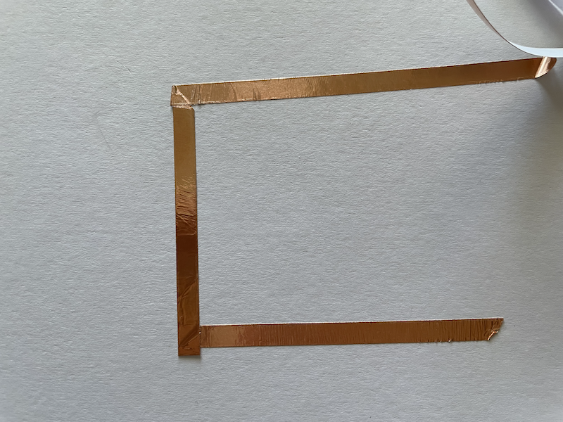

### Tips for Using LEDs 
The LED has two poles: a positive leg and a negative leg. The longer leg is the
positive pole, and the shorter leg is the negative pole.

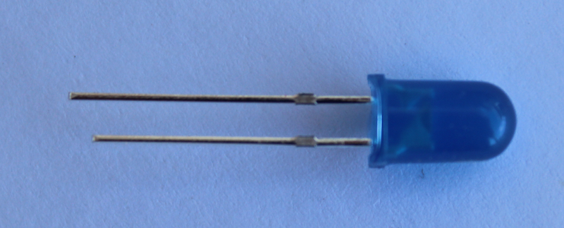

You can also determine which side is negative by the flat side of the LED head.
To add an LED to the paper, fold the legs outward so the LED is flush with the
paper. The copper tape will connect to the leg on the paper.

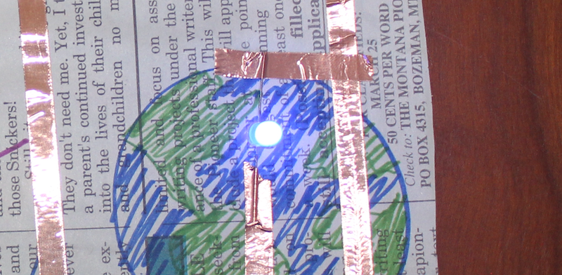

## 3 Circuit Playground Express 
The Circuit Playground Express (CPX) is a programmable microcontroller that is used as an introduction to computing systems. For this curriculum, we will be using the following features built into the CPX:
- 8 alligator-clip friendly input/output **pins**
- 5 mini **NeoPixels**
- 1 sound **sensor**

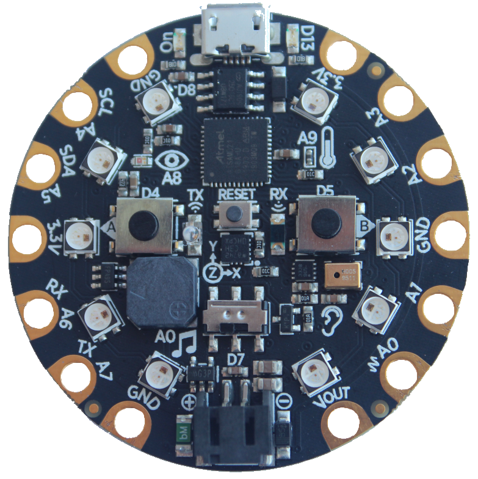

### Output Pins 
Students should connect the positive side of their LEDs to the following output
pins: **A0**, **A1**, **A2**, **A3**, **A4**, **A5**, **A6**, **A7**. An alligator
clip can easily connect to these pins.

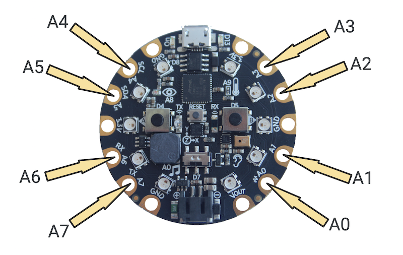

The negative line(s) of the LEDs should be connected to ground, which is notated
as **GND** on the Circuit Playground.

The **3.3V** volt pins are not programmable. There is constant current running
through these pins when the CPX is connected to a power source. Any LEDs connected
to **3.3V** will always be on. This could be a design decision for students if
they like.

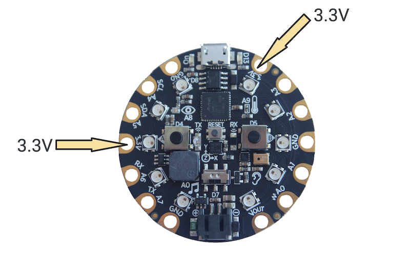

Students should *never* connect their project to **Vout**, as this can cause overheating
and potential smoke/fire.

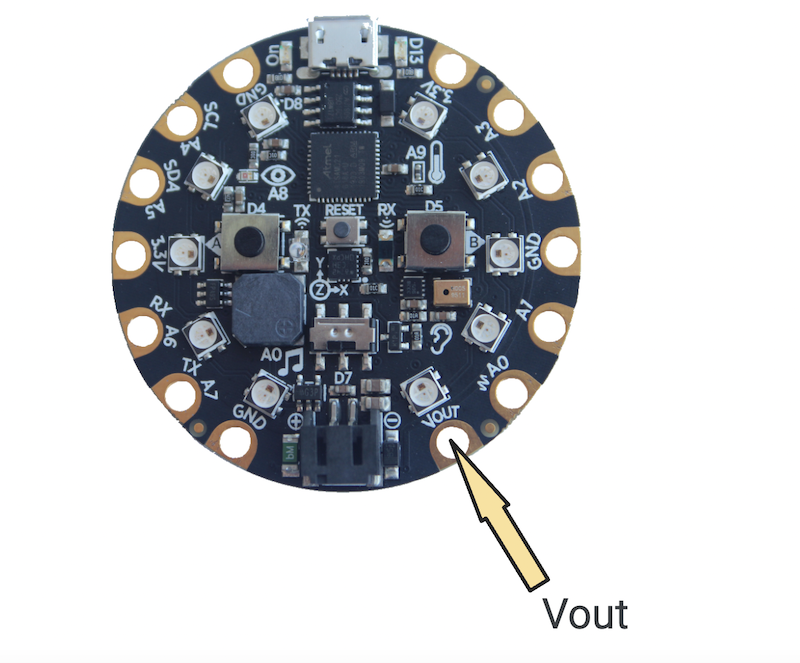

### NeoPixels 
There are ten NeoPixels on the Circuit Playground Express which will be used in
the Encryption Project [5-2 (Encryption)](../5-2/). The NeoPixels differ from
the individual LEDs connected in the Ledger Art Project that that they contain
additional data within them: **position**, **color**, and **brightness**. The positions of
the NeoPixels are provided here.

Adjusting the color and brightness of the NeoPixels is explored in the
[Coding Guide](../code/).

### Input 
Lesson [5-2 (Human-Computer Interaction)](../5-2/) uses the microphone on the
Circuit Playground Express.

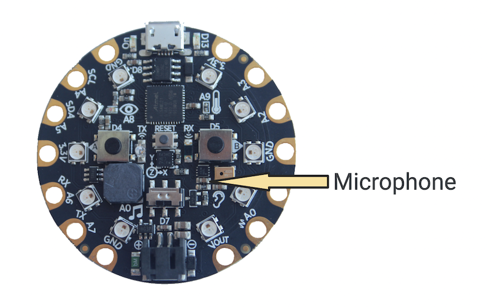

There are other sensors included on the CPX that this curriculum does not explore:
- motion
- temperature
- light
- infrared transmitter/receiver

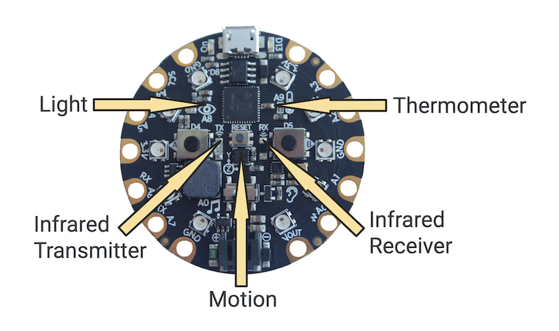

There are other input devices including two push buttons and a slide switch.
Pins **A1**, **A2**, **A3**, **A4**, **A5**, **A6**, **A7** can also be used
as touch sensors.

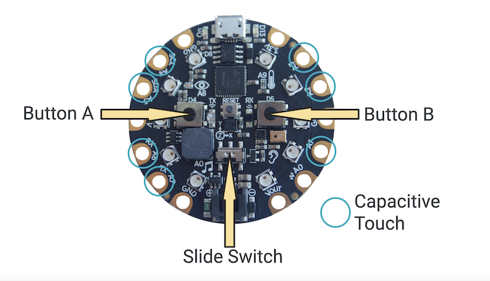

### Speaker 
Although not utilized in this curriculum, the speaker on the Circuit Playground
Express can play sounds, tones, and melodies. This is a great component to
use for differentiation should some students finish early.

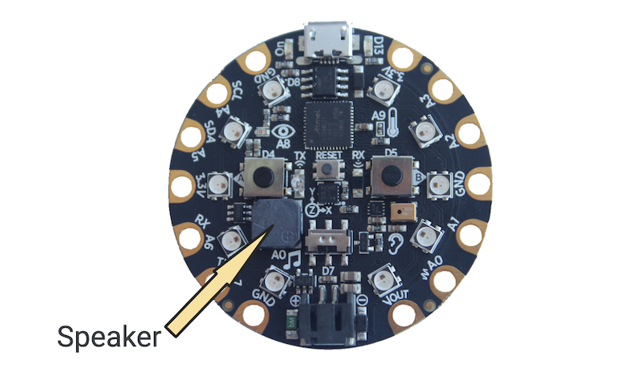
