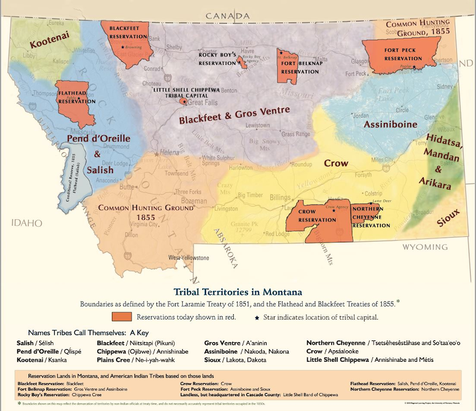

## Overview

| ---: | :--- |
| **Subject** | IEFA, Social Studies |
| **Grade Level** | 4-6 |
| **Duration**  | 50 minutes  |
|   |   |

## Established Goal(s)/Target(s)
- Students will be able to identify and label Montana’s seven tribal reservations on a map.
- Students will be able to explain what a treaty is and why they are important.

## Content Standards
- **IEFA Essential Understandings**
  - *EU 4 (Reservations / Land Reserved)* Though there have been tribal peoples living successfully on the North American lands for millennia, reservations are lands that have been reserved by or for tribes for their exclusive use as permanent homelands. Some were created through treaties, while others were created by statutes and executive orders. The principle that land should be acquired from tribes only through their consent with treaties involved three assumptions: I. Both parties to treaties were sovereign powers; II. Indian tribes had some form of transferable title to the land; III. Acquisition of Indian lands was solely a government matter not to be left to individual colonists or states.
  - *EU 5 (Federal Indian Policy)* There were many federal policies put into place throughout American history that have affected Indian people and continue to shape who they are today. Many of these policies conflicted with one another. Much of Indian history can be related through several major federal policy periods.
- **Other Content Standards**
  - *SS.G.4.1* examine maps and other representations to explain the movement of people.
  - *SS.G.4.2* identify and label the tribes in Montana and their indigenous territories, and current locations.
  - *SS.G.5.2* create, organize, and present geographic information to show settlement patterns in the United States, including impacts on tribal lands.
  - *SS.H.4.2* identify events and policies that have impacted and been influenced by tribes in Montana.
  - *SL.4.1* engage effectively in a range of collaborative discussions (one-on-one, in groups, and teacher-led) with diverse partners on grade 4 topics and texts, building on others' ideas and expressing their own clearly.
  - *W.4.10* write routinely over extended time frames (time for research, reflection, revision) and shorter time frames (a single setting or a day or two) for a range of discipline-specific tasks, purposes and audiences.
  - *RI.5.4* determine the meaning of general academic and domain-specific words and phrases in a text relevant to a grade 5 topic or subject area.
  - *SL.5.1* engage effectively in a range of collaborative discussions (one-on-one, in groups, and teacher-led) with diverse partners on grade 5 topics and texts, building on others' ideas and expressing their own clearly.
  - *W.5.10* write routinely over extended time frames (time for research, reflection, and revision) and shorter time frames (a single sitting or a day or two) for a range of discipline-specific tasks, purposes, and audiences.

## Prep
Teachers should complete the following preparation for the lesson:
- Prepare method for sharing images from computer to students.
- Write vocabulary words on board.
- Prepare [Why Treaties Matter \| NPR](https://www.youtube.com/watch?v=bexvE4lZRGo) video ([Transcript](../1-1-t1/)).
- Prepare [Why Do Treaties Matter \| Native Governance Center](https://www.youtube.com/watch?v=eCHZVSSXDwc) video. ([Transcript](../1-1-t2/)).
- Make copies of [Reservations Map](../resources/1-1_reservations-map.pdf) handout.
- Make copies of [2 Dollar Summary](../resources/1-1_two-dollar-summary.pdf) handout.

## Vocabulary
The following are terms used in this lesson.

 Term | Definition
 ---: | --
**Native American/American Indian/Indigenous**  |  terms to refer to groups of people who claim the earliest connection to land in the United States. These people lived in the United States before the United States existed and have maintained distinct cultures and ways of life. American Indian Tribes have status as independent (sovereign) Nations within the United States.
**Treaty**  |  an agreement made by negotiation; a contract in writing between two or more political authorities formally signed by representatives authorized to do so.
**Forced Relocation**  |  migration of people from one place to another, as ordered by the government.
**Assimilation**  |  the absorption of an individual or minority group of people into another society or group.
**Mainstream**  |  what most people in a society think is normal. American Indians and European Americans had different ideas about what was mainstream.
**Sovereignty**  |  ensures self-government, cultural preservation, and peoples’ control over their future; affirms the political identity of Indian Nations.
**Reservation** |  land reserved by a Tribe for their own use, through a treaty, and was not “given" to them.

## Lesson Guide

### Intro (10 mins)
Pass out [Reservations Map](../resources/1-1_reservations-map.pdf).  


Ask students to look at the map and discuss with their elbow partner:
```
What do you think the map represents?
What does each color represent?
Is this one map or two? What does each map tell you?
```

Explain to students that this map represents the current Native lands in Montana
and the as well as the Native lands in the 1800s.

### Think-Pair-Share (10 mins)
Write on board
```
What do you think happened to cause the areas to shrink?  
What do you know about tribes in Montana?
```
Bring out student ideas and facilitate a discussion.

### Video (10 mins)
Present [Why Treaties Matter \| NPR](https://www.youtube.com/watch?v=bexvE4lZRGo) to the class.
Discussion
```
What is a treaty?  
Why are treaties important?  
What does it mean to be a sovereign nation?
```
Present [Why Do Treaties Matter \| Native Governance Center](https://www.youtube.com/watch?v=eCHZVSSXDwc) video to summarize discussion.

### Vocabulary (10 mins)
Pass out [2 Dollar Summary](../resources/1-1_two-dollar-summary.pdf) handout.
Present the following vocabulary and relate back to the video. Students should follow along on handout.

Treaty
: an agreement made by negotiation; a contract in writing between two or more political authorities formally signed by representatives authorized to do so.

Forced Relocation
: migration of people from one place to another, as ordered by the government.

Assimilation
: the absorption of an individual or minority group of people into another society or group.

Mainstream
: what most people in a society think is normal. American Indians and European Americans had different ideas about what was mainstream.

Sovereignty
: ensures self-government, cultural preservation, and peoples’ control over their future; affirms the political identity of Indian Nations.

Reservation
: land reserved by a Tribe for their own use, through a treaty, and was not “given" to them.

### Two Dollar Summary (10 mins)
Ask students to write a “$2 summary” about treaties.
Each word costs 10 cents.
At least two vocabulary words needs to be used in their summary.
Students may work together.
