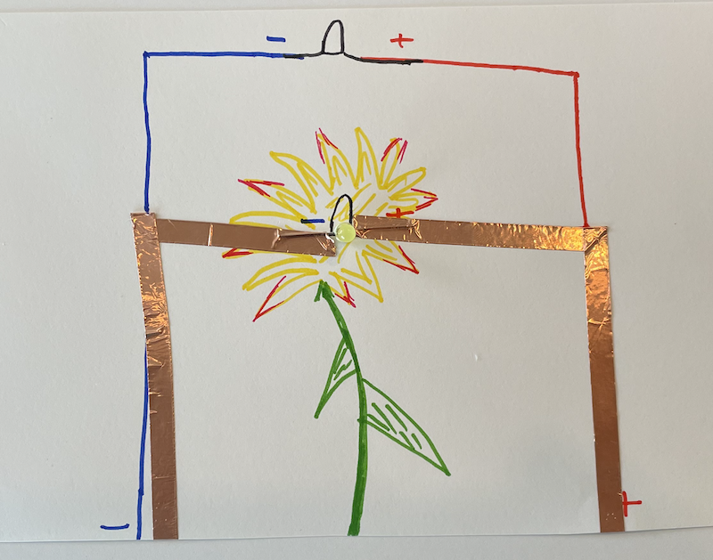
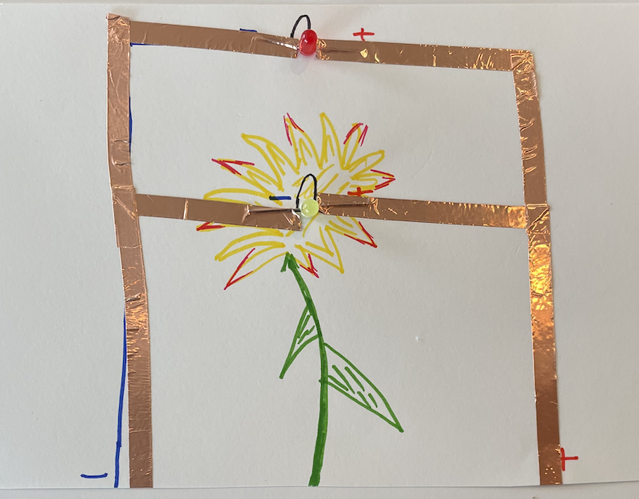

## Overview
Now that we have a single LED that turns on, the next question is... *how can we add more LEDS*?
If we want to add another LED to our simple circuit, there are two ways that we
can do this:
1. Add the new LED to the same output pin we used in the simple circuit.
2. Connect the new LED to a different output pin.

Each of these options have advantages and disadvantages. We will explore (1)
in this section (Parallel Circuits) and (2) in the next section ([Computational Circuits](../1-3/)).

## Circuit Diagram
<span class="important">Before continuing, make sure you unplug your Circuit Playground from your
computer. Whenever working on the circuit, make sure your project is not connected
to power.</span>

In order to add a second LED to the simple circuit, we can continue the positive
line to the positive pole of the new LED and the ground to the negative pole of the
new LED. That's it! Here is an example from the one we worked on.



### Do It Yourself
Using red for your positive line and blue for your negative line, map out where
you want your second LED to be located and draw lines from your current LED to
the new one. Make sure you label your components with + and - so you can easily
read your drawing later if necessary.

## Construct the Parallel Circuit
Add the LED with the poles going the direction indicated on your circuit diagram,
and add copper tape from your first LED to your second. Make sure the new copper
tape is strongly connected to your previous LED. If there are gaps in either your
positive side or negative side, the LED will not turn on.



Once done, plug your project into your computer. If the starter code is no longer
downloaded on your Circuit Playground, copy and paste the following into Arduino:

```
int myLED = 10;

void setup() {
  pinMode(myLED, OUTPUT);
}

void loop() {
  digitalWrite(myLED, HIGH);
}
```

Change the pin number to the one you used, compile the code by pressing the check mark
and download it into the microcontroller.

Both LEDs should light up! <span class="think">How is one pin turning on both of the LEDs? Try to think about what is happening at a physical level to turn both LEDs on using a single pin.</span>

## Make the LEDs Blink
We are now going to make the LEDs blink on and off every second. To turn a pin on,
use the code:

```
digitalWrite(myLED, HIGH);
```

To turn a pin off, use the code:

```
digitalWrite(myLED, LOW);
```

To make the code wait for a certain number of milliseconds, use the code:

```
delay(ms);
```

For example, if we want to delay for exactly one second, we would use the code:

```
delay(1000);
```

### Do It Yourself

**Task** We are now going to make our LEDs blink every second. <span class="think">Try to write in plain words what you want your LEDs to do if.</span> Write your code in the *loop* function
and download it to your project to see if it works. Keep revising your code until
you get it.

**Solution** (Hover right to view) <span class="solution">Turn LEDs on. Delay 1000. Turn LEDs off. Delay 1000.</span>

## Commenting
Moving forward, it is going to become very important to add comments to our code.
To add a comment, simply add two forward slashes at the beginning of a line:

```
// this is a comment
```

Code should be easy for others to read. Commenting is one way we can help others
quickly understand what our code does. Here is an example of the starter code
with comments:

```
int myLED = 10; //set the LED to pin#10

void setup() {
  pinMode(myLED, OUTPUT); //set pin#10 to OUTPUT
}

void loop() {
  digitalWrite(myLED, HIGH); //turn on the LED
}
```

### Do It Yourself
**Task** Add comments to your code to help others understand what it does.
