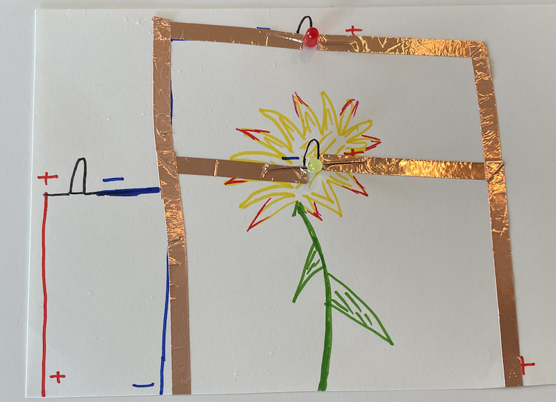
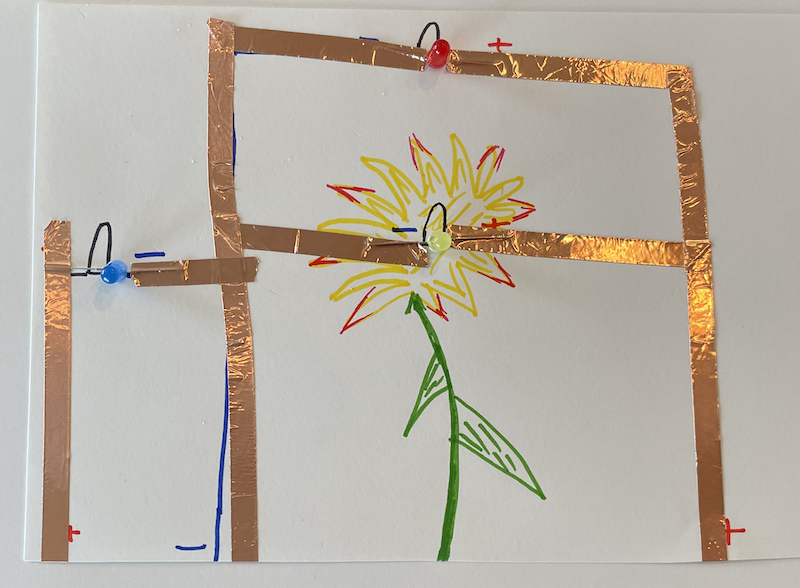

## Overview
The current investigation is how can we add more than one LED to a circuit. In
[Parallel Circuits](../1-2/), we learned that if we connect multiple LEDs by
simply continuing the positive and negative lines, then those LEDs would all be
connected to the same output pin on the Circuit Playground. This means that if we
turn on the pin, all the LEDs turn on.

**What if we want to control multiple LEDs separately?**

If we want to control multiple LEDs separately, we need to connect the positive
poles of our LEDs to different pins.

## Circuit Diagram
<span class="important">Before continuing, make sure you unplug your Circuit Playground from your
computer. Whenever working on the circuit, make sure your project is not connected
to power.</span>

In order to add a third LED to our project, we are going to connect the positive
pole of the new LED to a new pin on the Circuit Playground. You have two options
for the ground on the new LED:
1. Connect the new LED's negative pole to the ground that already exists
2. Add a new line for the new LED's negative pole and connect it to a different GND on the Circuit Playground.

Current flows from the positive pole of the power source (the output pins) to the
load. Current returns to the power source via ground; it doesn't matter how it gets
there.

For example, in our example, we drew a circuit diagram for a computational circuit
where the ground on the new LED connects to the ground that was previously created.



We then added copper tape and an LED to the circuit diagram.



We connected the positive pole of the new LED to pin 12. To turn on the LED, we
had to declare a new variable for pin 12. In the *setup* function, we set pin 12
as an OUTPUT. Finally in the loop, we called *digitalWrite* on pin 12 to *HIGH*.

### Do It Yourself
1. Draw a third LED to your circuit diagram that can be independently controlled.
2. Add copper tape and an LED as designed.
3. Modify your code by creating a new variable for the new pin, set the pin as an output, and turn the pin on.

## Program Multiple Pins
At this point, you now have two LEDs in parallel (par) and an independently connected
LED (ind).

### Do It Yourself
**Task** Program the circuit so that the par LEDs and ind LED blink each second alternatingly.
In other words, when the par LEDs are on, the ind LED is off. And when the ind LED
is on, the par LEDs are off.

**Solution** (Hover right to view) <span class="solution">Assume par LEDs are connected to pin 10 and ind LEDs are connected to pin 12 --> digitalWrite(10, HIGH); digitalWrite(12, LOW); delay(1000); digitalWrite(10, LOW); digitalWrite(12, HIGH); delay(1000);</span>

## Functions
We have already seen some predefined functions like *digitalWrite* and *pinMode*.
We can create our own functions as well.

A **function** is a block of code that allows us to call the name of the function
rather than the block of code over and over. For example, let's turn the blink
light pattern into a function:

```
int myLED = 10;             //set the LED to pin#10

void setup() {
  pinMode(myLED, OUTPUT);   //set pin#10 to OUTPUT
}

void loop() {
  blink();                  //call the blink function
}

void blink() {
  digitalWrite(myLED, HIGH); //turn on the LED
  delay(1000);               //wait 1 second    
  digitalWrite(myLED, LOW); //turn off the LED
  delay(1000);               //wait 1 second
}
```

Notice how below (and outside) the *loop* function, we define a function called
*blink*. Then in the *loop* function, we call

```
blink();
```

Defining a function called *blink* below the *loop* is now enough to make the
function actually happen. You need to both define the function AND call the function
in the *loop* for the function to run.

### Do It Yourself
**Task** Create a function below the *loop* called *alternateBlink* that programs
the parallel LEDs and independent LED to blink each second alternatingly. Call
*alternateBlink* in the *loop*. Test your code.
