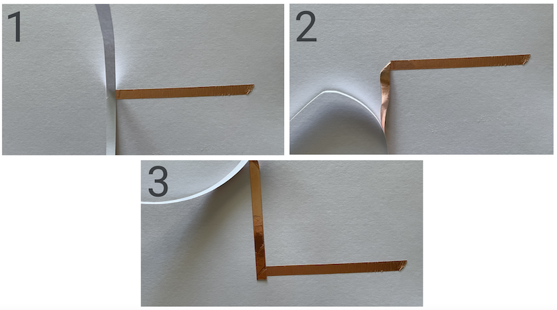

## Overview

| ---: | :--- |
| **Grade Level** | 6-8 |
| **Duration**  | 150 minutes  |
|   |   |

## Established Goal(s)/Target(s)
- Design and create simple, parallel, and computational circuits.
- Code sequential light patterns using functions.

## Computer Science Standards
- *CS.AP.6-8.1* use algorithms to address complex problems.
- *CS.AP.6-8.2* create clearly named variables that represent different data types and perform operations on their values.
- *CS.AP.6-8.10* document programs in order to make them easier to follow, test, and debug.

## Materials
The following materials are required for this lesson:
- 1 Computer with Arduino IDE downloaded
- 1 Circuit Playground Classic
- Copper tape
- 3 LEDs
- 3 Alligator clips
- 1 USB to microUSB
- Card stock

## Vocabulary
The following are terms used in this activity.

 Term | Definition
 ---: | --
**Circuit**  |  composed of individual electronic components, such as LEDs, connected by conductive material (copper tape or conductive thread) which electric current can flow through.
**Current**  |  a flow of positive electric charge.
**Conductor**  |  materials that allow the flow of electric current.
**Insulator**  |  materials that block the flow of electric current.
**Load**  | any component in an electrical circuit that consumes power or energy.
**LED**  |  an example of a load; a device that emits light when an electric current passes through it.
**Polarity**  |  current flows in one direction from the positive pole to the negative pole of a power source in our circuits.
**Circuit Diagram**  |  a way to visualize and communicate circuits to others.
**Microcontroller**  |  a small computer on a single chip that stores a single program. The Circuit Playground Express is an example of a microcontroller.
**Variable**  |  used to store information to be referenced and manipulated in a computer program.
**Function**  |  a “chunk” of code that you can use over and over again by name.

## Simple Circuit
Before we begin working on the **Friend-O-Meter*, we will practice making circuits
and using code to control the flow of current through the circuit using the
Arduino programming language.

### Learn about Simple Circuits
A **circuit** is comprised of a power source, **conductive** material, and some
**load**. In our circuits, the computer will act as the power source. We will be
using copper tape and alligator clips as our conductive material, and LEDs will
serve as our load.


Above is an example of a circuit diagram. As shown, our circuits will have a
positive part and a negative part. Current flows from the power source to the load
along the conductive material, and then returns back to the power source along
the negative part of the circuit, which we call **ground.** In our circuit diagrams,
we will use red to denote our positive lines and blue to denote ground, our
negative lines. **Polarity** is the idea that each of the components in our circuits
must adhere to the idea that current flows from positive poles to negative poles.

Every battery (power source) you have used has two poles (+ / -). Likewise,
the LEDs we will be using also have two poles, which are in the LED's legs.
The longer leg of the LED is positive and the shorter leg is negative. We can also
use the head of the LED to figure out which side is negative; there is a little cut
on the side of the head on the negative side. As shown in the figure above,
the positive pole of our power source will connect to the positive pole of the
LED and the negative pole of the power source will connect to the negative pole
of the LED. If an LED does not light up when it should, try checking to make sure
you did not **reverse the polarity** or connect positive to negative by accident.

### Craft a Simple Circuit
We are now ready to craft our first circuit! First, let's make a circuit diagram
for our simple circuit.

#### Simple Circuit Diagram
In this curriculum, we are going to use the Adafruit Circuit Playground Classic,
plugged into our computer, as the power source. We will add this later to our
circuit. On our circuit diagrams, we will connect the Circuit Playground to the
circuit using alligator clips after we add the LEDs and copper tape to our circuit.
So we will connect the Circuit Playground to the bottom of our circuit, as shown.


On card stock, draw an image that you would like to add an LED to. In the above
example, we drew a ___ <span class="todo>Add text here</span>. After your
aesthetic drawing is done, we are ready to add our circuit diagram.

1. Draw where you want your LED to be placed, and note on either side the polarity of the LED. In our example above, we used a red + for the positive side and a blue - for the negative side.
2. Draw a line (red for positive, blue for negative) from the LED poles to the bottom of the card stock. Note the polarity of each line by adding a + or - at the bottom of the card next to each line. Adding the polarity on the circuit diagram gives us more information about the circuit later when we may have forgotten what we did.

#### Add the Components
Now that your circuit diagram is complete, we are ready to add the components.
You will need:
- 1 LED
- Copper tape


1. Orient the LED on the paper in the same polarity as you drew.
2. Add copper tape starting from each pole of the LED and follow the line you drew.

To add the copper tape, peel off the white paper on the back, and add the tape
to the card stock along your lines. It is important that you use a different piece
of copper tape for your positive line and your negative line. **Do not ever let
your positive and negative lines touch.** This is called a short circuit, and
your circuit will not work.

It is highly encouraged that you use a single piece of copper tape for each line.
This means that you may need to add a corner to your tape. To do so, fold and crease
the tape in the opposite direction that you want to go. Then fold the tape over
itself in the direction you are going, and seal it tight to the paper with your
fingers.



If you need to use multiple pieces of tape on a single line, make sure your pieces
of tape are securely connected to each other. Current must flow through conductive
material, and any gaps in the material will stop your current from continuing.

#### Add the Circuit Playground
Why is the LED not lighting up? Well, we have not yet attached our power source.
Let's do that now.

1. Connect the negative line at the bottom of the card to a **GND** (ground) pin on the Circuit Playground. Use an alligator clip to connect the metal of the pin to the copper tape.
2. Connect the positive line at the bottom of the card to any of the digital out pins on the Circuit Playground. The digital out pins are: **3**, **2**, **0**, **1**, **12**, **6**, **9**, **10**.
3. Connect the microUSB to the Circuit Playground and the USB to your computer.

In the example below, we connected the the negative line to **GND** and the positive
line to ___ <span class="todo">Add pin numer</span>.


If your LED does not turn on after connecting the Circuit Playground, **do not worry**!
If your LED were to turn on now, there would be something very wrong. This is because
the Circuit Playground is a **microcontroller** that can be programmed to control
the flow of current through its pins. We have not yet told the microcontroller
that we want current to flow through the pin we chose and therefore to the load.
So without further ado, let's start programming!

#### Write Code to Control Current Flow
The Circuit Playground can store only one program at a time. We can write code in
the Arduino programming and download our code onto the Circuit Playground. As long
as the Circuit Playground is connected to a power source, the downloaded code will
run forever in a neverending loop. When new code is downloaded onto the Circuit
Playground, it will overwrite the code that was on there and the new code will run
forever... or until we download new code again.

**Setup Arduino.**
1. Download the [Arduino IDE](https://www.arduino.cc/en/software). IDE is an integrated development environment, and is where we will be writing our code.
2. Open Arduino and create a new *sketch*. A sketch in Arduino is a file where we write code. Sketches can be saved onto our computer's drives and reopened at any time.
3. Go to *Tools*, click on *Board*, and choose *Adafruit Circuit Playground*. This will tell the IDE which Arduino board we are using.
4. Go to *Tools*, click on *Port*, and choose the port where your Circuit Playground is plugged in. Make sure your Circuit Playground is plugged into your computer's USB port.

**Use the starter code to turn on your LED.**
1. Copy and paste the following code into an *empty* sketch.

```
int myLED = 10;

void setup() {
  pinMode(myLED, OUTPUT);
}

void loop() {
  digitalWrite(myLED, HIGH);
}
```

2. In the first line, change the number *10* with the number pin you connected your circuit to. We chose *10* because that is the pin we used. Do not include letters or hashtags; just put the number.
3. Click on the *check mark* in the top left corner. This will **compile** your code so that the computer can understand it, and will tell you if you have any errors in your code.
4. Click on the *right arrow* just next to the check mark. This will download the code into your Circuit Playground. Wait a couple of seconds, and your LED should turn on!

**Explanation of the starter code.**

Variables
digitalWrite
Circuit diagram

## Parallel Circuit
Circuit diagram
Sequences
Commenting

## Computational Circuit
Circuit diagram
Functions
