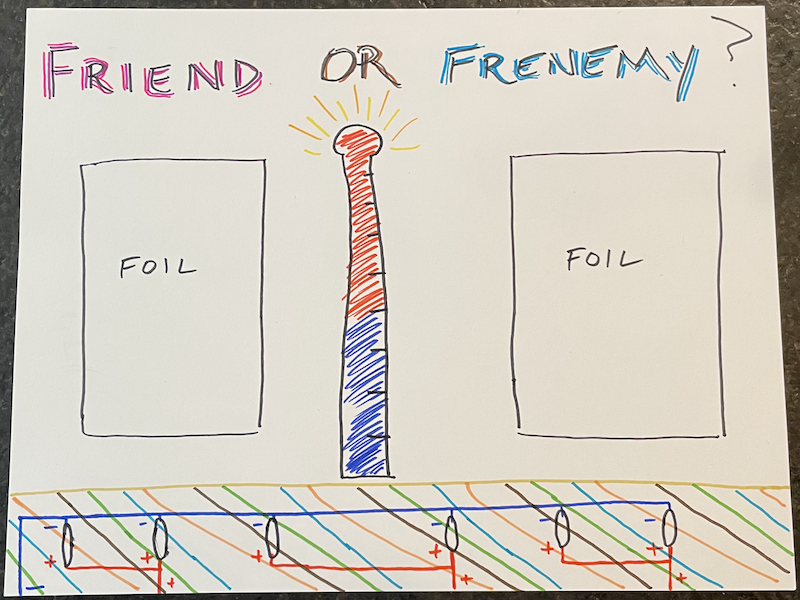
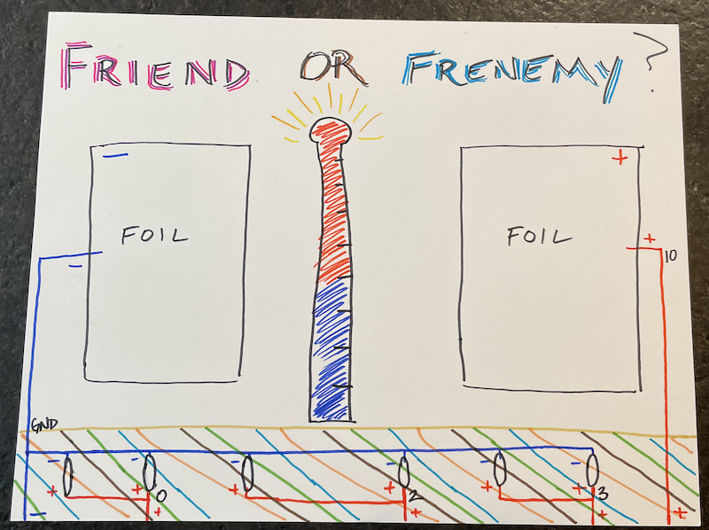

## Overview
Before engaging in this section, you should be familiar with:
- Parallel and computational circuits
- Coding a light pattern using the Arduino language
- Functions

If you skipped these concepts, go back to [Circuits](../1-0/) and go through that section.

In this section, we will build the base of the *Friend-O-Meter* by:
- drawing the aesthetic design
- incorporating touch sensors to the aesthetic design
- adding a circuit diagram
- testing the LEDs
- creating a light pattern for the LEDs
- playing with the touch sensors

This project will be your own design, and you will make choices along the way. We will provide an example of our own as guidance, but your project may and should look different. Your decisions will lead to computational challenges that you will need to problem solve. For this reason, this guide will detail the decisions we made and how those decisions impact the coding.

## Aesthetic Design
We will continue to add functionality to the *Friend-O-Meter* beyond this section such as NeoPixels to note the friendship level, music, and a reset button.

For the purpose of creating the aesthetic design, you will create a friendship tester using two pieces of aluminum foil. Two or more people will hold hands, and two different individuals will touch one of the sensors to complete the circuit. The aluminum foil can be any size you want; however, the larger the foil, the greater range you will get when testing, which will affect your coding. The two foils can be placed anywhere on the card stock, but they cannot touch. Additionally, you do not want the copper tape going to your LEDs to touch the aluminum foil. You will add at most six LEDs and create a light pattern to make your design look spectacular.

For now, do not worry about the circuit. Just draw your imagery for the project, and note where you want your LEDs and touch sensors to go.

For our project, we made the following aesthetic design.

## Circuit Design
Now that we have placed the sensors and LEDs on the card stock, we need to make some decisions.
1. Will any of your LEDs be in parallel, or will they all be connected to different pins? You will need to think about what you want your LEDs to do and decide how you can make your intentions happen.
2. Where will you connect the Circuit Playground? When we did the [Simple Circuit](../1-1/) and [Parallel Circuit](../1-2/), we connected at the bottom of the project. This is your project so you can make this decision yourself.

For this, you will need:
- 1 Circuit Playground Classic
- <= 6 LEDs
- 2 Pieces aluminum foil cut into whatever shape you want
- Copper tape
- <= 7 Alligator clips
- Card stock
- USB to microUSB

### LEDs
The LEDs can be connected to any of the digital out pins. The digital out pins are: **3**, **2**, **0**, **1**, **12**, **6**, **9**, **10**.

First, we drew the positive lines of the LEDs. Since we only need one ground, we drew a path from the negative pole of each LED in a single ground line, as shown. Starting with the positive lines made this process easier. We decided to make each LED connect to a different pin, but if you are planning on having some LEDs in parallel, think about how you will connect their positive lines.

At the base of each line, we wrote which pin to connect the line to. This will help us remember everything moving forward.

### Touch Sensors
There are two touch sensors; one will act as ground, and the other will be programmed as an analog input. We will discuss what analog in means at the end of this section. One of the touch sensors will connect to **GND** and the other will connect to one of the analog input pins. The analog input pins are named slightly differently than the digital output pins. The table below shows the four pins that can handle analog input and their analog names (yes, when we use analog input pins, they are named differently and we need to use their analog names when we code them).

Digital Output Pin # | Analog Input Pin #
------------------:  | :-----------------
10  | A10
9  | A9
6  | A7
12  | A11
  |  

For our circuit diagram, we chose to connect the positive sensor to ___ Enter number

