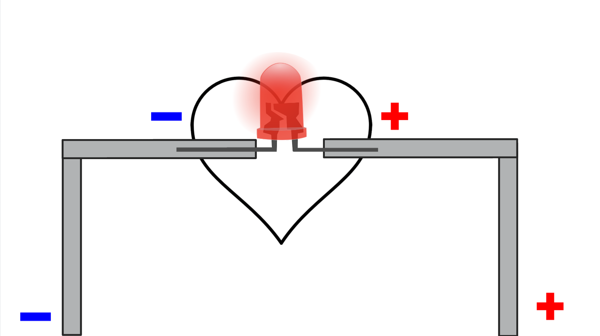
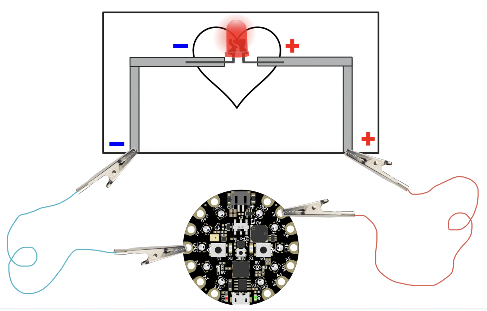

## Subject/Course
Science, CS

## Grade Level
4/5    

## Established Goal(s)/Target(s)
-	Students will be able to understand and construct simple circuits.
-	Students will be able to identify necessary components of a circuit (power, conductors, polarity, etc.)
-	Students will be able to describe the transfer of energy in a circuit.
-	Students will be able to explain how we use programming to manipulate the transfer of energy in a circuit.

## Montana Standards
- <u>4-PS3.A</u> make observations to provide evidence of transfer of energy from place to place by sound, light, heat, and electric currents
- <u>4-PS3.B</u> apply scientific ideas to design, test, and refine a device that converts energy from one form to another

## Evidence of Learning
-	Students can articulate how the components of a circuit work together to turn on an LED.
-	Students can articulate how energy is converted in a circuit.
-	Students can articulate how programming is used to manipulate the transfer of energy in a circuit.

## Prep
Teachers should complete the following preparation for the lesson:

- Make sure computers have internet and work.
- Ensure that [MakeCode](https://makecode.adafruit.com/) is not blocked; talk to IT if necessary.
- Prepare supplies as a kit per student pair (copper tape, 1 LED, 1 CPX, 2 alligator clips)
- Have copies of [Simple Circuit Diagram](../resources/2-1_circuit-diagram-handout.png) (card stock) and [Intro to Programming handout](../resources/2-1_intro-to-programming.pdf).
- Have link to [Simple Circuit Start Code](https://makecode.com/_KT4idefaATm9) ready to give to student pairs.
- Place students into pairs.
- Write warm up question on the board.

## Vocabulary
Electronic Circuit
: composed of individual electronic components, such as LEDs, connected by conductive material (copper tape or conductive thread) which electric current can flow through.

Electric Current
: a flow of positive electric charge.

Electrical Conductivity
: the measure of a material’s ability to pass an electric current.

Electricity
: the flow of electric charge.

Polarity
: a power source (like a battery) has two poles (+/-). When poles are connected by conductive material, current flows from the positive pole to the negative pole.

Conductors
: materials that allow the flow of electric current.

Insulators
: materials that block the flow of electric current.

Light Emitting Diode (LED)
: a device that emits light when an electric current passes through it.

Resistor
: a device that reduces current flow.

Microcontroller
: a small computer on a single chip. The Circuit Playground Express is an example of a microcontroller.

## Lesson Guide

### Introduction (estimated 10 minutes).
Think-Pair-Share
```
How do you think a light turns on?
```
In a class discussion, teacher brings out ideas from students, focusing on the flow of energy from a power source to the light component. As students form their ideas, write the following words on the board that matches their unformed ideas: **Circuit**, **Current**, **Electricity**, **Conductor**, **Insulator**.

By the end of the discussion, bring out the idea that we use a power source combined with conductors to generate a flow of energy through a circuit.

### Simple Circuit Diagram and Instruction (20 minutes).
Teacher passes out [Simple Circuit Diagram](../resources/2-1_circuit-diagram-handout.png).

Explain that the card stock is an insulator. Write **insulator** on the board if not already there. Explain that an insulator blocks energy flow.

Teacher invites students to take out the LED. Explain that the goal is to create a circuit that turns on the LED. Write **Light Emitting Diode** on the board and explain that the LEDs we are using have a resistor. Write the word **resistor** on the board. Explain that a resistor reduces the flow of energy. The LEDs we use can only handle so much energy flow so we need to ensure that we do not overpower the component, or they could break, but that is already handled for us.

Invite students to place the LED on the diagram. Direct them to the positive and negative sign on either side of the LED symbol. Write the word **polarity** on the board. Explain that power sources have two poles: positive and negative. Current flows from the positive side to the negative side. The positive node of the LED must be securely connected to the positive side of the power source, and the negative side of the LED must be connected to the negative side of the power source. We use conductors (like copper tape) to connect components like LEDs to a power source. A common error made when making circuits is *reversing the polarity* of components. For example, flipping the LED so that the + and – sides are reversed. When we draw circuit diagrams in this class, we will distinguish positive as a red + and negative as a blue -. We always label the polarity of each of our components.

Teacher invites students to take out copper tape. Write **conductor** on the board if not already there. Explain that conductors allow for the flow of energy. Conductors do not have polarity; they just allow the current to flow so we can use the same conductor on both sides of the circuit. We need to connect the conductor to a power source or there will be no current.

Model best practices of laying down the copper tape: use one large piece per side; when making a corner, fold the opposite direction you want to go, and fold back down in the direction you want to go.

Invite students to individually construct the simple circuit on the diagram template by laying the copper tape per side.

Think-Pair-Share
```
Use the vocabulary on the board to describe how energy flows through a circuit.
```

### Turn the Lights On: Intro to Programming (20 minutes).
Teacher posts link to [Simple Circuit Starter Code](https://makecode.com/_KT4idefaATm9) in [MakeCode](https://makecode.adafruit.com/) and demonstrates how to remix the code for editing. Invite students to take out the CPX. Write the word **microcontroller** on the board and explain that a microcontroller is a computer that does a single task. We download code into the microcontroller, and it can only do that code, repeating it forever. Point out that there are microcontrollers everywhere: streetlights, elevators, escalators. Any time you have a device that has a single purpose, microcontrollers are there.

Model how to connect an alligator clip from negative line to ground and positive line to the A7 pin (as shown).

Explain that ground is the negative pole, and the numbered pins are positive poles. Inform students that *Vout* will not be used in this unit, and *3.3V* is a pin that is always on. All the other numbered pins must be instructed to turn on and off to allow the energy to flow. When *A7* is told to turn on, or set to HIGH, energy will flow from the *A7* pin through the conductor, across the LED, and back to ground. When *A7* is turned off, or set to LOW, we block energy from flowing.

Tell students that we do not program ground, which is negative. We just need ground to allow the current to come back to the power source after passing through the LED(s).

Invite students to connect the CPX to their circuit and download the code.

The LED should turn on. If it does not, help students fix the circuit by checking the connections.

In pairs, students read through code and write down three questions they have about the blocks they see. Teacher fields questions. During question fielding, if the question does not come up, ask which pin they think “digital write pin *A7* to HIGH” is communicating with and what it does.

Tell students that they will work together to make the LED blink on and off every second. Explain that we must be very specific when we give instructions to a computer.

Pass out [Intro to Programming Handout](../resources/2-1_intro-to-programming.pdf). Invite students (in pairs) to write down on the handout what it means for an LED to turn on and off every second (part 1). Say that we always storyboard our code before we program. Programming is the process of translating human intention so that a computer can act on it. When ready, invite students to share their storyboards out loud. Look for “turn led on, pause 1 second, turn led off, pause 1 second, repeat forever.”

Direct students to Part 2 on the *Exploring Circuits* handout. Invite students to use the blocks in *MakeCode* to translate their storyboard. When done, students should download their code to the CPX. The LEDs should blink. If errors occur, invite students to read through their code and see how each line represents their written storyboard, looking for some inconsistency.

| Block | Location |
| ----  | -------- |
| digital write pin ___ to high | ADVANCED --> PINS |
| digital write pin ___ to low  | ADVANCED --> PINS  |
| forever | LOOPS  |
| pause ___ (ms) | LOOPS (1000 ms = 1 sec) |

### Homework
Direct students to Part 3 on the handout. Invite students to explain how the code and pins on the CPX control the flow of current through the circuit to turn the LED on and off.
