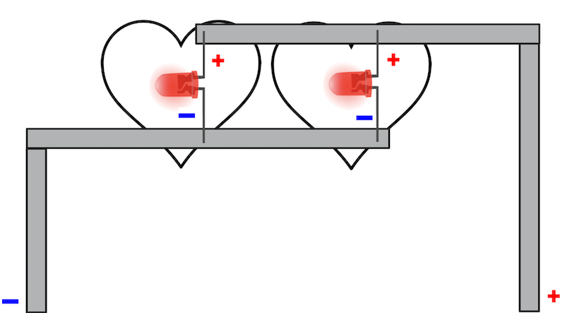
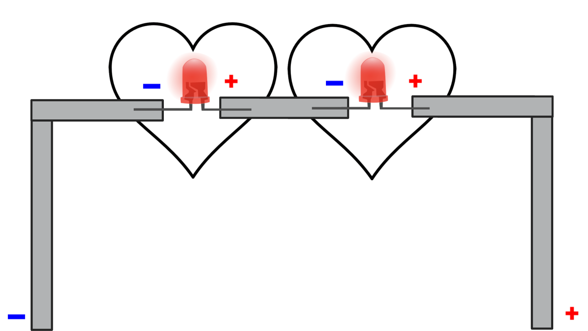
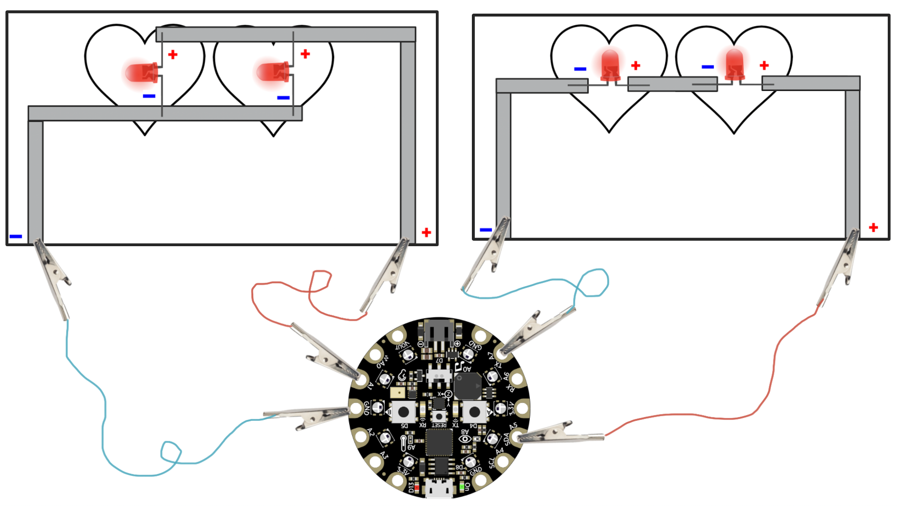
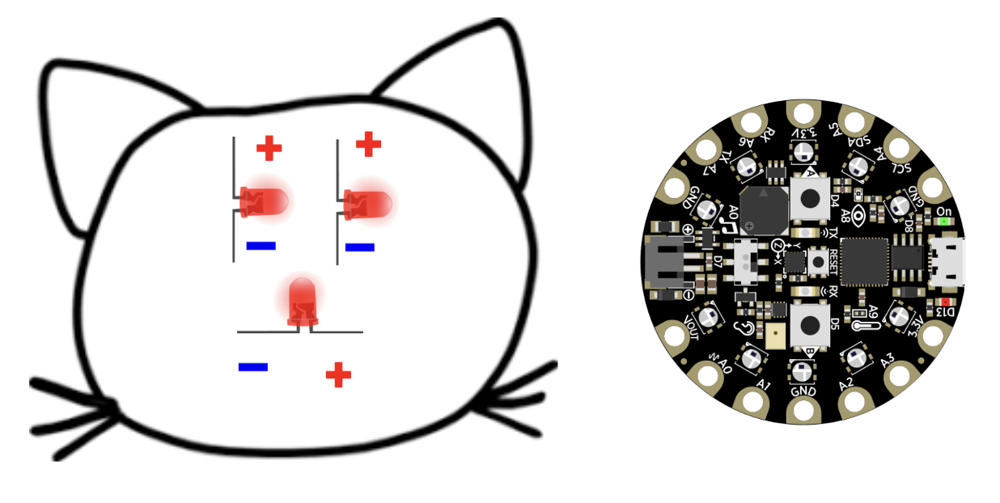

## Subject
Science, CS

## Grade Level
4/5    

## Established Goal(s)/Target(s)
-	Students will be able to understand and construct parallel and series circuits.
-	Students will be able to describe the voltage difference between a parallel and series circuit.
-	Students will be able to explain how a single microcontroller can control the flow of multiple circuits.

## Montana Standards
- <u>4-PS3.A</u> make observations to provide evidence of transfer of energy from place to place by sound, light, heat, and electric currents.
- <u>4-PS3.B</u> apply scientific ideas to design, test, and refine a device that converts energy from one form to another.
- <u>4-PS4.C</u> generate and compare multiple solutions that use patterns to transfer information.

## Evidence of Learning
- Students can articulate the difference between a parallel and series circuit.
- Students can articulate the difference in voltage between a parallel and series circuit.
- Students can articulate how a single microcontroller can control the flow of multiple circuits.

## Prep
Teachers should complete the following preparation for the lesson:

- Make sure computers are functional and [MakeCode](https://makecode.adafruit.com/) is not blocked.
- Prepare supplies as a kit per student (copper tape, 4 LEDs, 1 CPX, 4 alligator clips)
- Make copies of [Parallel Circuit Diagram](../resources/2-2_parallel-circuit-diagram.pdf) handout, [Series Circuit Diagram](../resources/2-2_series-circuit-diagram.pdf) handout, [Computational Circuit Diagram](../resources/2-2_computational-circuit-diagram.pdf) on card stock, and cut out the templates (1/pair).
- Have copies of [Exploring Circuits](../resources/2-2_exploring_circuits.pdf) handout (1/pair).
- Place students into pairs.
- Write warm up question on the board.

## Vocabulary
The following are terms used in this lesson.

Term | Definition
-- | --
**Voltage**  |  the pressure from an electrical circuit's power source that pushes charged electrons (current) through a conducting loop.
**Parallel Circuit**  |  a parallel circuit is one that has two or more paths for the electricity to flow.
**Series Circuit**  |  a series circuit comprises a single path along which the whole current flows through each component.

## Lesson Guide

### Introduction (5 minutes)
Think-Pair-Share
```
If you wanted to add a second LED to the simple circuit, how might you do it?
```
During discussion, emphasize the need to add more conductive material to connect a second LED. Lead into next activity by indicating that there are multiple ways we can connect the second LED.

### Parallel Circuit Diagram (15 minutes):
Teacher hands out [Parallel Circuit Diagram](../resources/2-2_parallel-circuit-diagram.pdf) handout to pairs. Teacher explains that it is a parallel circuit.

Pairs add the copper tape and 2 LEDs to the parallel circuit diagram as written.

Pass out [Exploring Circuits](../resources/2-2_exploring_circuits.pdf) handout to each student. Direct students to Part 1. Students should talk in pairs and individually answer the question: Assume current is flowing through the circuit and the LEDs are on. On the parallel circuit, if you were to remove a section of copper tape between the two LEDs, what do you think would happen? Explain your reasoning.

Bring students back for a discussion. Bring out the idea that the first LED is still connected to a closed loop, and current will flow through it; however, current will not flow through the second.

### Series Circuit Diagram (15 minutes):
Pass out [Series Circuit Diagram](../resources/2-2_series-circuit-diagram.pdf) and direct students to the series diagram.

Write the word **voltage** on the board and explain that voltage is the pressure from an electrical circuit's power source that pushes charged electrons (current) through a conducting loop. In a parallel circuit, the voltage is constant throughout the circuit. Tell students that series circuits are different: as current flows through each LED, the pressure decreases. If you have too many LEDs, the later LEDs in series will not turn on because there is not enough current to power them.

Pairs add the copper tape and 2 LEDs to the series diagram as written.

Direct students to Part 2 of *Exploring Circuits*. Students should talk in pairs and individually answer the question:
```
What is the difference between a parallel and series circuit?  
In the future, which would you rather use for multiple LEDs and why?  
Does voltage play a role in your decision?
```
Bring students back for a discussion. Bring out the idea that if a connection breaks in a parallel circuit, depending on where that connection is, some LEDs can still turn on. Additionally, the voltage is constant throughout a parallel circuit, so we do not lose current; whereas in a series circuit, the voltage decreases with each LED the current passes through.

### Computational Circuits (15 mins)
Tell students that they will now turn the LEDs on both circuits on using the same CPX. Pass out the [Computational Circuit Diagram](../resources/2-2_computational-circuit-diagram.pdf) handout.

While students are constructing the series circuit, write the four functions students will need to code on the board:

| Block | Location |
| ----- | -------- |
| digital write pin ___ to high | ADVANCED --> PINS |
| digital write pin ___ to low  | ADVANCED --> PINS |
| forever | LOOPS |
| pause ___ (ms) | LOOPS (1000 ms = 1 sec) |

Invite pairs of students to open [MakeCode](https://makecode.adafruit.com/) and create a new project. Give students the task of connecting the parallel circuit and series circuit to the CPX and programming them to blink alternatingly. Parallel on and series off for 1 second, then parallel off and series on for 1 second, and repeat forever. Remind students that they can use a different pin for each circuit.

### Homework
Complete Part 3 of the *Exploring Circuits Handout*.
```
If you wanted to program the eyes of the cat to blink together  
and the nose to always be on, draw a circuit diagram that could  
align with your intention.
```

