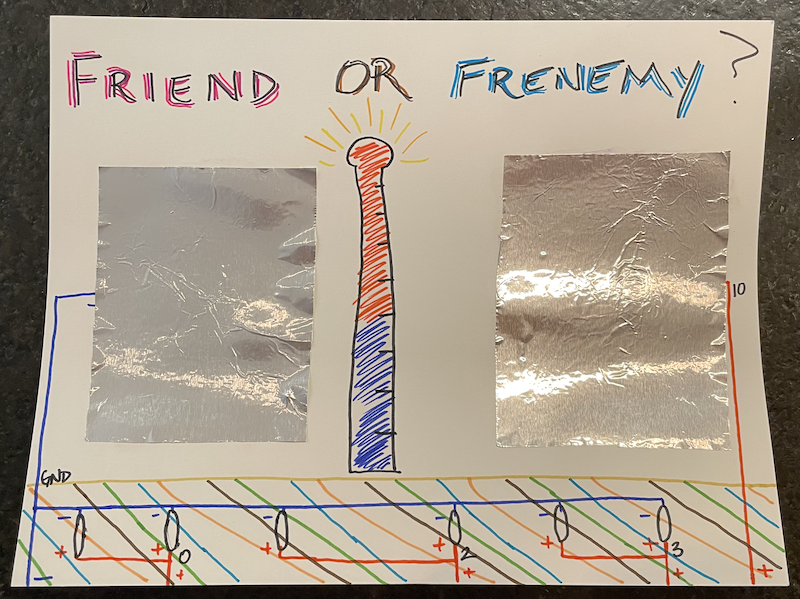
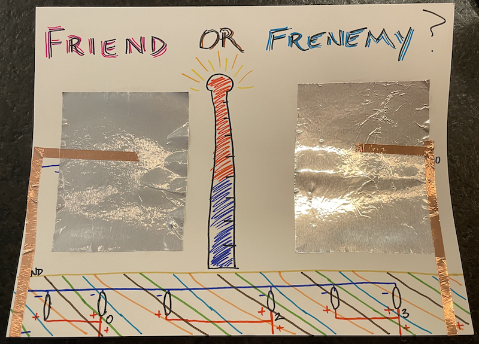
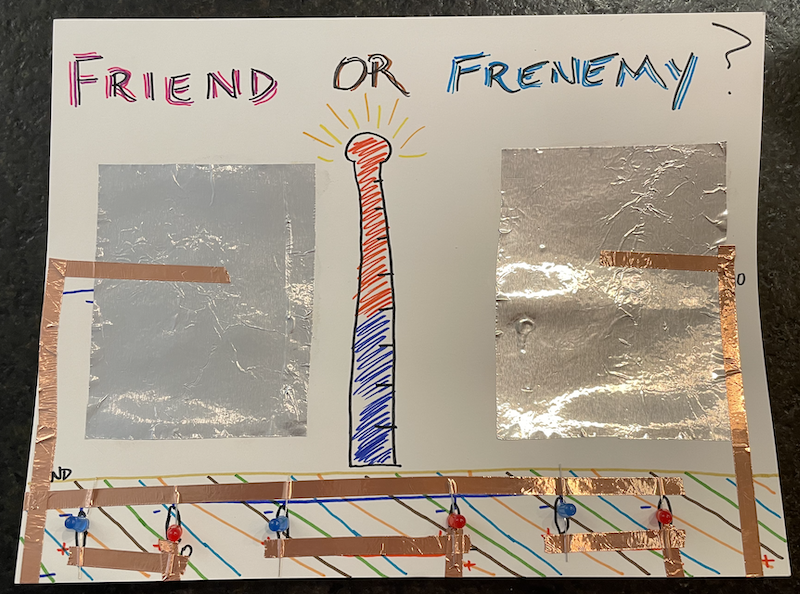
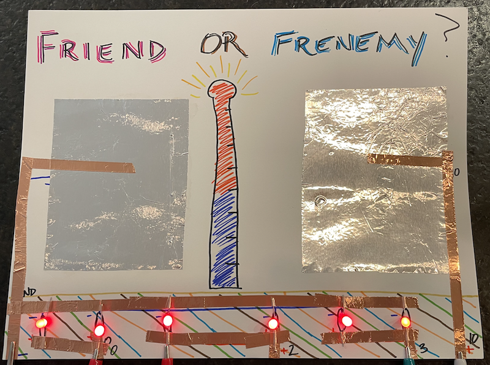

## Overview
Now that you have a circuit diagram, it is time to add the sensor patches and LEDs
and connect the circuit using the copper tape.

## Craft

### Touch Sensors
Cut the aluminum foil into whatever shape you want for your touch patches. Glue the foil firmly to the card stock.

Add copper tape across the patches and continue the lines from your circuit diagram.

### LEDs
*[Optional] If you are adding your circuit diagram on the back of your design, you can poke holes in the card stock using the 1/8" hole puncher so that the LED heads can poke through to the front of your project.*

1. Connect the positive line of each LED to secure the LED to the paper.
2. Connect the ground line of your LEDs.

## Code
Test your LEDs.
1. Create a descriptively named variable for each output pin you use.
2. In the *setup* function, use the *pinMode* function to set each declared pin as an *OUTPUT*.
3. In the *loop* function, call *digitalWrite* to set each pin to *HIGH*.
4. Download the code into the Circuit Playground.

If your lights do not turn on, first check your physical connections. Then check your code.
You may notice that the blue LEDs in previous images turned into red LEDs here. When we turned the pins on, we noticed that the blue LEDs were not turning on. We then tried a red LED where the blues were, and it worked. We realized that blue light is a higher frequency than red light, and takes more energy to turn on. So given a "choice," the current went through the red LED. This is why earlier we noted that if LEDs are in parallel, they should be the same color.

Additionally, this is all part of the debugging process. Things may not work the first time, and through testing and checking, we can isolate challenges in our project and create plans to overcome them.
