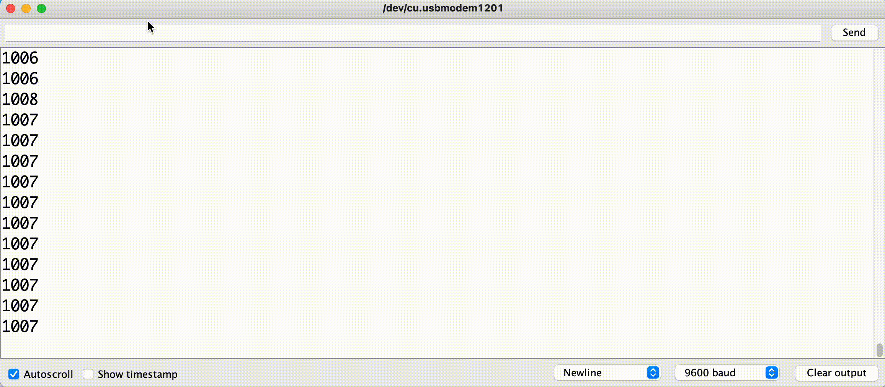

## Overview
We will now code the aluminum foil to be an analog input for capacitive touch. Then we will test the sensor and observe what kind of data comes from the sensor and consider how we can use it to create three different categories.

## Sensors

### Analog Input
So far, we have seen the function *digitalWrite*, which sends information to a pin in **digital** form. Digital, in this case, means that the information is binary; that is, we are sending either a value of 0 (LOW) or 1 (HIGH) to the pin in order to turn an LED off or on.

We will now be using a function called *analogRead* to get information from the pin we connected the sensor to. Here, **analog** means that the information we are getting from the pin is going to be any value from *0* to *1023*.

### Setup the Sensor
In order to turn the aluminum foil into a sensor in which we can read analog values, we will use code to:
- Setup the aluminum foil as an INPUT,
- Send current to the foil so we can read its capacitance,
- Read the value coming from the foil and store that value in a new variable, and
- Print out the value being read from the sensor.

#### Starter Code
Copy and paste the following starter code in an *empty* Arduino sketch:

```
//Part 1
int touchSensor = A10;  //name your aluminum foil patch
                        //change the value to the pin you used

//Part 2
void setup() {
  Serial.begin(9600); //allows you to print to the Serial Monitor
  pinMode(touchSensor, INPUT); //sets the aluminum foil patch to input
  digitalWrite(touchSensor, HIGH); //sends current to the aluminum foil patch
}

//Part 3
void loop() {
  int touchVal = analogRead(touchSensor); //reads the current value of the aluminum foil and
                                          //stores the value in a new variable
  delay(100); //waits 1/10 of a second
  Serial.println(touchVal); //prints the sensor value to the Serial Monitor
}
```

In **Part 1**, we declare and initialize the aluminum foil using the analog output pin it is connected to. In the starter code, we used the analog input pin from the example in [Aesthetic & Circuit Design](../2-1/) and [Build the Base](../2-2/), but you will need to change the value to whatever pin you used for your aluminum foil.

Notice that although we connected the foil to pin *10*, we initialize the pin to *A10* in the code. When using an analog input, we need to use the analog input values of the pin. Here are the four pins that allow analog input with their relative analog input values:

Digital Output Pin # | Analog Input Pin #
------------------:  | :-----------------
10  | A10
9  | A9
6  | A7
12  | A11
  |  

In **Part 2**, we setup two different necessary components: the Serial Monitor and the sensor pin. The **Serial Monitor** is a communications mechanism for programmers, and will not be seen by users. We often use the Serial Monitor to help debug code and log data. We will use it for displaying the data being read by the sensor. We need to tell Arduino to begin the Serial Monitor, which is done using the following code:

```
Serial.begin(9600);
```

Next, we need to setup the pin be an input so that we can get information from the pin. We do this using the code:

```
pinMode(touchSensor, INPUT);
```

Finally, we turn the pin on so that current can run to the positive aluminum foil. Just like with the LEDs before, we do this in the *setup* function using the code:

```
digitalWrite(touchSensor, HIGH);
```

It is important to note here what is physically happening with the sensors. The two aluminum foil are not connected. By invoking *digitalWrite* on the positive aluminum pin, we send current to the foil. But again, the positive foil is not connected to the negative foil. The circuit is not connected as is. Somehow, we need to complete the circuit so that the current can flow to the negative pole (the foil attached to ground) and return back to the power source (the Circuit Playground). <span class="think">How are we going to complete the aluminum foil circuit so that the current can travel from the positive foil to the negative foil?</span>

To understand how we are going to complete the circuit, remember that the human body is conductive. If a person were to touch both touch pads, the current will travel from the positive foil, through their body to the negative foil, and back to the power source along ground. Even cooler, if two or more people were to hold hands and touch the aluminum foil, the current would travel through everyone to complete the circuit. This is the physical phenomenon behind the *Friend-O-Meter*.

In **Part 3**, we read the sensor using the code:

```
analogRead(touchSensor);
```

This function will **return** or output a number that represents the current value being read by the sensor. But if we do not store that number somewhere, we will not be able to do anything with it. So we store the value being read in a new variable called *sensorVal*:

```
int sensorVal = analogRead(touchSensor);
```

It is important to note here that *touchSensor* is the pin that the sensor is connected to and *sensorVal* is the current value being read by *touchSensor*.

We then print out the current sensor value to the Serial Monitor using the code:

```
Serial.println(sensorVal);
```

The *println* function prints the value and then goes to a new line after. If we used the function *print*, all the values would print on a single line.

#### Upload the Code
Once the code is ready, upload the code to the Circuit Playground. You may notice that nothing is happening. This is because our code is printing the values to the Serial Monitor, not affecting any of the LEDs. So we need to open the Serial Monitor in the Arduino IDE.

#### Serial Monitor
To open the Serial Monitor:
1. Click *Tools*
2. Click *Serial Monitor*

The Serial Monitor should open, and if the code is uploaded to the Circuit Playground and the Circuit Playground is connected to your computer, you should see a bunch of numbers over 1000 in a list.

Touch both foils. The values should change now and be smaller.



The more capacitance being read by the sensor, the lower the number is going to be. <span class="think">What is the lowest number you can get? Do you think everyone will have the same lowest number?</span>

If someone is near you, ask them to hold your hand. One person should touch one sensor and the other person should touch the other. What is the lowest number you can get? Is it different from the one you each got alone?

## Data Testing
Let's now collect some data and observe how different people interact with the sensor. Find as many people as you can to test the sensors. What is the lowest value each person can get? What is the highest value each person can get? Use this chart to help guide your inquiry:

Person | Lowest Number | Highest Number
:----- | :-----------: | :------------:
  |   |  
  |   |  
  |   |  
  |   |  
  |   |  
  |   |  

<span class="think">What do you notice about these data? If you wanted everyone to be able to use your sensors, what value would work for everyone?</span>
