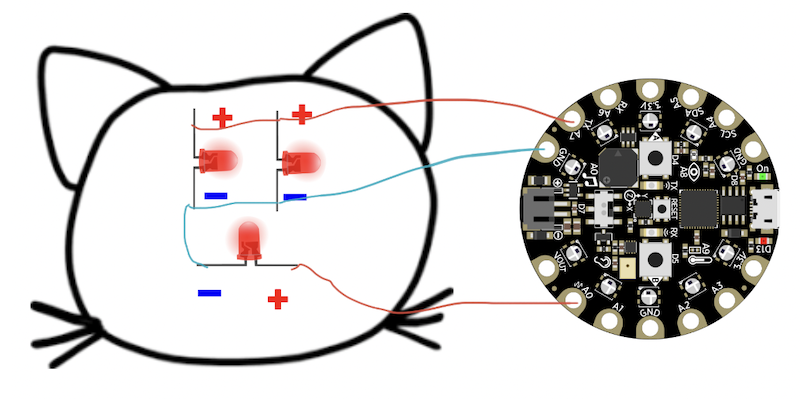

## Subject
ELA, Visual Arts

## Grade Level
4/5    

## Duration
100 minutes

## Established Goal(s)/Target(s)
-	Students will be able to understand and construct a visual narrative in the style of ledger art.

## Montana Standards
- <u>W.4.3</u> write narratives to develop real or imagined experiences or events using effective technique, descriptive details, and clear event sequences.
- <u>W.4.5</u> with guidance and support from peers and adults, develop and strengthen writing as needed by planning, revising, and editing.
- <u>W.5.3</u> write narratives to develop real or imagined experiences or events using effective technique, descriptive details, and clear event sequences.
- <u>W.5.3.a</u> orient the reader by establishing a situation and introducing a narrator and/or characters; organize an event sequence that unfolds naturally.
- <u>W.5.5</u> with guidance and support from peers and adults, develop and strengthen writing as needed by planning, revising, editing, rewriting, or trying a new approach.
- <u>Anchor Standard #1</u> Generate and conceptualize artistic ideas and work. Collaborate on multiple approaches to a creative art or design problem and develop a plan from concept to completion for an artwork.
- <u>Anchor Standard #4</u> Select, analyze, and interpret artistic work for presentation. Describe how past, present, and emerging technologies impact the preservation and presentation of artwork.
- <u>Anchor Standard #8</u> Construct meaningful interpretations of artistic works. Analyze subject matter, form, and use of media in artwork.
- <u>Anchor Standard #10</u> Synthesize and relate knowledge and personal experiences to make art. Create artworks that reflect community cultural traditions.

## Evidence of Learning
- Students can successfully build a symbolic narrative of an experience and compose a visualization that depicts their narrative in the style of ledger art.

## Prep
Teachers should complete the following preparation for the lesson:

- Put [Brainstorm Posters](../resources/3-1_brainstorm-posters.pdf) around room
- Have copies of [Brainstorm Scoot](../resources/3-1_brainstorm-scoot.pdf) handout (1/student)
- Have copies of [Using Symbols to Tell Stories](../resources/3-1_telling-stories-with-symbols.pdf) handout (1/student)
- Card stock (1/student) <span class="todo">Need dimensions of card stock</span>
- Have stack of newspapers ready
- Colored markers / pencils (no graphite)
- Glue
- Scissors

## Vocabulary
The following are terms used in this lesson.

Term | Definition
-- | --
**Computational Circuit**  |  circuits that can control the flow of current by processing sequential steps made by humans.
**Visual Narrative**  |  a story told primarily using visual media.

## Lesson Guide

### Discussion of Computational Circuits (10 mins)
Invite students to take out Part 3 of [Exploring Circuits](../resources/2-2_exploring-circuits.pdf) handout (from 2-2).

Ask students to share their designs with their partner.

On board, show possible solutions (one solution is shown).

Explain what a **computational circuit** is
```
Circuits that can control the flow of current by processing sequential steps.
```
Explain that we use code to allow current to flow through each of the pins. In the example above, when *A7* is set to HIGH, both eyes turn on since both lights are connected to *A7*.

### Brainstorming Activity (20 mins)
Pass out [Brainstorm Scoot](../resources/3-1_brainstorm-scoot.pdf) handout.

Put students into seven groups.

Tell groups to go to a certain # poster. If groups are numbered, they can go to the poster of their number.

Tell students they have two minutes to individually think of a story from their life inspired by the prompt on the poster. Students should individually jot down notes of the story that comes to mind – not write out the entire story. The story should be meaningful and say something about who they are.

After two minutes, groups rotate to the next poster. Continue until each group has visited each poster.

### Creating Symbolism (20 mins)
Tell students to choose a story from the *Brainstorm Scoot* session that they feel most connected to and want to express through art.

Pair students. Pass out [Using Symbols to Tell Stories](../resources/3-1_telling-stories-with-symbols.pdf) handout. Invite students to tell each other their story. Pairs will support each other in creating symbols to reflect different the people, events, emotions, and context of their story. Teacher walks around and supports students.

### Designing the Ledger Art Inspired Design (50 mins)
Students complete [Using Symbols to Tell Stories](../resources/3-1_telling-stories-with-symbols.pdf) handout if not already done.

Remind students of what ledger art is and its meaning (past and present) to Montana Tribes.

Explain that like ledger art, they will tell their story told primarily using visual media and symbolism.

Explain the Ledger Art Project.
- Students will design a visual narrative using symbols on newspaper that tells their chosen story (the one they plotted).
- Students will then place LEDs on their art and program the LEDs to highlight key elements of their visual narrative.

Pass out card stock.

Students cut out newspaper and glue to card stock.

Students design a visual narrative on the card stock.

Students draw the visual narrative on the newspaper/card stock.
