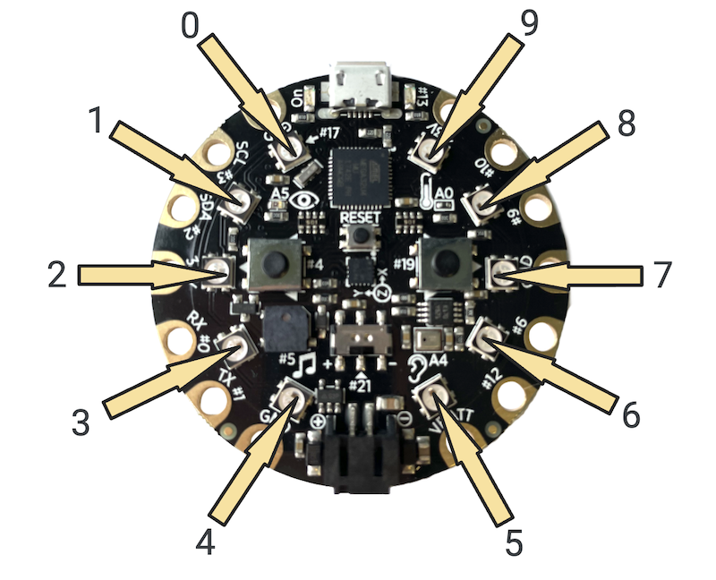

## Overview
Now that we have three functions that will run based on three conditions for the touch sensor, let's do something other than just print out whichever category was invoked. We will use **NeoPixels** on the Circuit Playground to give the users a spectacular visualization of their friendship. Unlike the LEDs we attached to our projects with copper tape, we can program the NeoPixels to change any color on the color wheel. So before we start coding the NeoPixels, we need to understand how colors work with light.

## Pixel Color Values
Colored light works a little differently than colored paint. When you mix a lot of paint together, the color gets darker and murkier. But when you add more light, color gets brighter and lighter. If we represent RGB colors as (R,G,B), then white is (255,255,255) since turning on all light makes white light, and black would be (0,0,0), where we turn off all the light. In other words, white light is all channel colors turned on, and black is the absence of light.

All the colors on the color wheel can be made using an additive mixture of red, green, and blue. For short, we call this mixture **RGB**. Each **color channel** (red, green, blue) has a value from *0* (no color) to *255* (full color).

Here are a sample of colors with their mixed values:

Color | Red | Green | Blue
----: | --- | ----- | ----
<span style="color:red">Red</span>  | 255  | 0  | 0
<span style="color:green">Green</span>  | 0  | 255  | 0
<span style="color:blue">Blue</span>  | 0  | 0  | 255
<span style="color:cyan">Cyan</span>  |  0 | 255  |  255
<span style="color:magenta">Magenta</span>  | 255  | 0  |  255
<span style="color:yellow">Yellow</span>  | 255  | 255  |  0
<span style="color:brown">Brown</span>  | 165  | 42  |  42
<span style="color:aquamarine">Aquamarine</span>  | 127  | 255  |  212

## Loops & NeoPixels
There are ten NeoPixels on the Circuit Playground, and each can be programmed to change its brightness and color. We can reference the individual NeoPixels using its **index**, or its numbered position.



### NeoPixels
We are going to control the NeoPixels using the Adafruit CircuitPlayground library. We can use the library by including a certain header file called **Adafruit_CircuitPlayground.h**. So in order to tell Arduino that we will be using code from this library, at the beginning of our code, above everything else, we need to write

```
#include <Adafruit_CircuitPlayground.h>
```

Just importing the library is not enough; we also need to initialize the library. To do this and make the library code usable in our program, in the *setup* function, we call

```
CircuitPlayground.begin();
```

Now that we have imported the library that contains a function that will allow us to turn on each NeoPixel and initialized the library so we can use, we can start playing with the NeoPixels. In the *loop* function, we use the following code to set the color value of a NeoPixel at position *n*:

```
CircuitPlayground.setPixelColor(n, red, green, blue);
```

For example, if we want to set the NeoPixel at position 4 to cyan (0,255,255), then we would write

```
CircuitPlayground.setPixelColor(4, 0, 255, 255);
```

If we want to turn off all of the NeoPixels, we can use the function:

```
CircuitPlayground.clearPixels();
```

The following is sample code that would turn all of the NeoPixels to the color red:

```
#include <Adafruit_CircuitPlayground.h>

void setup() {
  CircuitPlayground.begin();
}

void loop() {
  CircuitPlayground.setPixelColor(0, 255, 0, 0);
  CircuitPlayground.setPixelColor(1, 255, 0, 0);
  CircuitPlayground.setPixelColor(2, 255, 0, 0);
  CircuitPlayground.setPixelColor(3, 255, 0, 0);
  CircuitPlayground.setPixelColor(4, 255, 0, 0);
  CircuitPlayground.setPixelColor(5, 255, 0, 0);
  CircuitPlayground.setPixelColor(6, 255, 0, 0);
  CircuitPlayground.setPixelColor(7, 255, 0, 0);
  CircuitPlayground.setPixelColor(8, 255, 0, 0);
  CircuitPlayground.setPixelColor(9, 255, 0, 0);
}
```

This seems like a lot of redundant code. Really, all we are doing here is changing the position (index) of the NeoPixel and keeping the rest of the code the same. If only there were a way that we could write some code to loop through the numbers 0 to 9. Oh wait, there is.

### The For Loop
Here we will talk about a very particular loop that will allow us to run through the indices of the NeoPixels easily. The *for loop* is used when we know how many times we want to repeat code. If we wanted to write the code above using a *for loop*, it would look like this:

```
void loop() {
  for(int i = 0; i < 10; i++) {
    CircuitPlayground.setPixelColor(i, 255, 0, 0);
  }
}
```

Let's discuss each part of this code. We declare an index called *i* and initialize it to *0*, as the first NeoPixel position is *0*. *i < 10* is the condition for when the code inside the loop will run. If this condition is true, the loop will repeat. The final part of the loop is *i++*. This line is the same as writing *i = i + 1*, and is a way for us to increment the index every time we loop. So first, *i* is *0*. Since *0 < 10*, the code inside the loop will run. Since *i* is *0*, We are setting the pixel color of the NeoPixel at position *0*. Then *i++*, and *i* is now *1*. Since *1 < 10*, the code will run, and we set the color of the NeoPixel at position *1*. This will continue through *i = 9*. Finally, when *i = 10*, the code will check the condition, and since *10 < 10* is false, the loop will end.

If we wanted to set the NeoPixels on the right side of the Circuit Playground in the image above to blue, we would need to loop through positions *5* through *9* and the code would look like this:

```
void loop() {
  for(int i = 5; i < 10; i++) {
    CircuitPlayground.setPixelColor(i, 0, 0, 255);
  }
}
```

## Visualize Friendship Using NeoPixels

<video src="../images/3-2_neopixels.mp4" loop width="800"></video>

**Task** Add to the code you wrote in [Conditionals](../3-1/). In each function below the loop, instead of just printing out which function is running, use the NeoPixels to give the users a strong visualization of their friendship level. Remember, you will need to:
1. Import the CircuitPlayground library
2. Initialize the CircuitPlayground library
3. Call the *setPixelColor* for whichever NeoPixels you want in each of the three functions.
