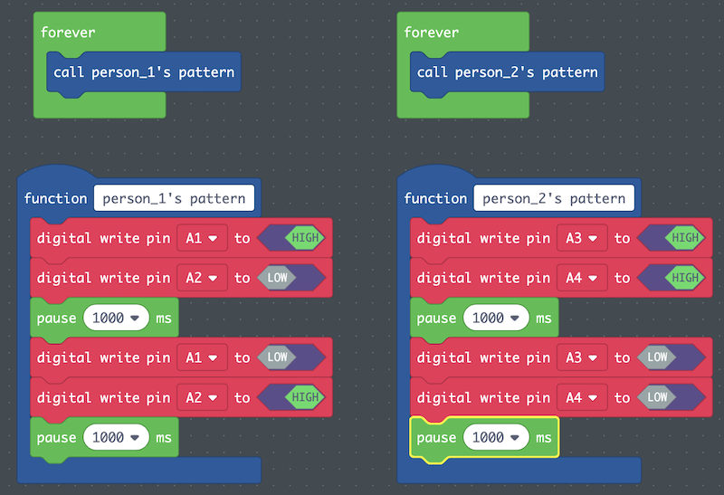

## Overview

| ---: | :--- |
| **Subject** | CS |
| **Grade Level** | 4-6 |
| **Duration**  | 50 minutes  |
|   |   |

## Established Goal(s)/Target(s)
-	Students will be able to understand and program a computational circuit.
-	Students will be able to recognize and explain functions as an abstraction.
-	Students will be able to identify bugs and debug their code.

## Content Standards
- **Computer Science Standards**
  - *CS.AP.4.2* break down problems into smaller, manageable subproblems to facilitate the program development process.
  - *CS.AP.4.3* test and debug a program or algorithm to ensure it runs as intended.
  - *CS.AP.5.3* create programs that include sequences, events, loops, and conditionals.
  - *CS.AP.5.5* describe choices made during program development.
- **Other Content Standards**
  - Add other standards re: reading

## Prep
Teachers should complete the following preparation for the lesson:

- Have copies of [Debugging Code](../resources/3-3_debugging.pdf) handout (1/pair)
- Make sure computers are functional and [MakeCode](https://makecode.adafruit.com/) is not blocked.
- One computer per pair
- Make sure you can present *MakeCode* from your computer to the class.
- Students should have the [Storyboarding the Ledger Project](../resources/3-2_storyboard-ledger.pdf) handout from [3-2](./3-2.md).

## Vocabulary
The following are terms used in this lesson.

Term | Definition
---: | --
**Algorithm** | a process or set of rules to be followed in calculations or other problem-solving operations, especially by a computer.
**Pair Programming**  |  two people write code together on one machine. It is a very collaborative way of working and involves a lot of communication.
**Functions**  |  a basic task of a computer, especially one that corresponds to a single instruction from the user.
**Abstraction**  |  the process of naming things so that the name captures the core of what a function or a whole program does.
**Bug**  |  an unexpected problem with software or hardware, often unintentional.
**Debug**  |  the process of removing bugs from software or hardware.

## Lesson Guide
### Coding Lesson (20 mins)
Expert modeling. On overhead, teacher creates a new project in [MakeCode](https://makecode.adafruit.com/), and defines a function named “person_1’s pattern” and creates one of the patterns shown below, talking through out loud what is happening. Make a forever block above and call the function. Show students where the function blocks and loop blocks are.

Explain that if we want to use multiple pins, then we need to code each pin separately. If I want pin *A1* to be HIGH and pin *A2* to be LOW, then we make a block for each separate pin. We need to think about when we want things to happen. Computers run code very quickly, so although code will run from top to bottom, putting the two blocks next to each other will happen so quickly that it looks as if they are happening at the same time.

Explain that we use functions to call a group of blocks. If we want to call that same group of blocks over and over, we will ordinarily need to write all the blocks each time we want them – but with a function, we can write the blocks once and then just call the function. Relate this to tying shoes. We can make a function called “Tie Shoes” where we list all the steps. But then by calling “Tie Shoes,” we just run through those steps because we already know what this means. So when we say “I am tying my shoes,” everyone who knows the steps knows what we are talking about. Defining a function for a computer to understand is the same.

Define roles for driver/navigator

Driver
: the person at the wheel, i.e., the keyboard. They are focused on completing the defined objective. A driver should always talk through what they are doing while doing it.

Navigator
: the person in the observer position while the driver is typing. They review the code on-the-go, give directions, and share thoughts.

Explain driver/navigator switching. Ordinarily, the driver and navigator should switch often. This activity will be more structured to give students a first experience with pair programming.
- First, break a larger problem down into smaller, more manageable problems. Here, we are breaking down the problem of coding two Ledger Projects using a single Circuit Playground Express by coding each separately, one at a time in a separate function, to make the larger problem easier to do.
- Second, the pair decides on workflow. Which subproblems will each person take driver, and which will they be navigator? Here, since each student is in charge of their own Ledger Project and light pattern, each student will drive when coding their own pattern into a function.
- Third, after each subproblem (light pattern) is complete, the driver and navigator switch (which means moving the computer or their seats).
- Fourth, we test the code, understand where potential errors may exist, and work together to talk through what every line of code is doing. It is best if the driver for each function talks through their own code, and the navigator acts as a soundboard, double checking that what should be happening in the code is happening.

### Pair Programming (30 mins)
Pass out Storyboarding the Ledger Project Handout

Teacher gives students the first task for each driver:
- Create a function named *___’s light pattern.*
- In a forever block, call the function. To make our code easier to read, in this class, we will put function definitions below and the actual code that runs (the forever block) above (as shown above).
- Driver 1 will translate the storyboard from *Storyboarding the Ledger Project* handout, Part 4.
- Explain that while the driver codes their light pattern in their function, they should be talking through what they are doing out loud. The navigator should review the code on-the-go, provide direction, and share their thoughts.
- After the first driver finishes their code, switch roles. The second driver should now code their light pattern similarly.

### Debug the Light Patterns (30 mins)
If students have not finished constructing their circuit, they need to do this before debugging.

If students have not finished their driver/navigator workflow, this should be done first.

Hand out the [Debugging Code](../resources/3-3_debugging.pdf) handout. Tell students to work on it together step by step.

Teacher walks around and supports pairs that need help.

### Share (20 mins)
Gallery Walk
- Each pair plugs in their project so it runs and leaves it on the desk.
- Pairs add a blank piece of paper next to their projects.
- Pairs walk around and add positive feedback to each group’s project.
