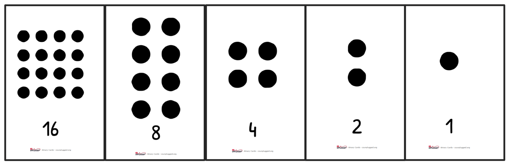
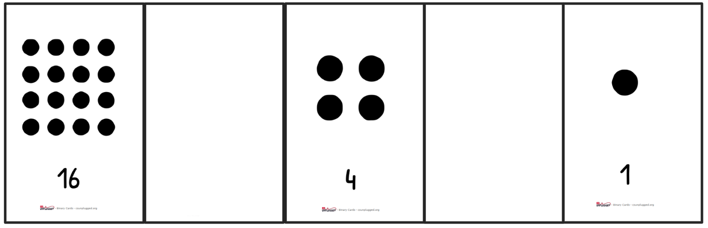
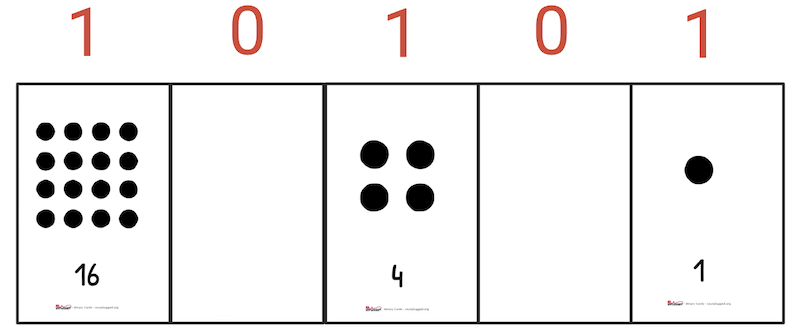

## Overview

| ---: | :--- |
| **Subject** | Math, CS |
| **Grade Level** | 4-6 |
| **Duration**  | 50 minutes  |
|   |   |

## Established Goal(s)/Target(s)
-	Students will be able to identify binary numbers.
-	Students will be able to convert decimal to binary and explain their process.
-	Students will be able to design and describe a communication protocol using binary numbers.

## Content Standards
- **Computer Science Standards**
  - *CS.IC.4.3* describe ethical issues that relate to computing devices and networks.
  - *CS.IC.5.1* explain how computing technologies have changed Montana and the world, and express how those technologies influence, and are influenced by, cultural practices.
  - *CS.IC.5.3* utilize diverse perspectives for the purpose of improving computational artifacts.
  - *CS.IC.5.5* describe ethical issues that relate to computing devices and networks.
- **Other Content Standards**
  - *4.OA.3* Solve multi-step word problems within cultural contexts, including those of Montana American Indians, with whole numbers and having whole-number answers using the four operations, including problems in which remainders must be interpreted. Assess the reasonableness of answers using mental computation and estimation strategies including rounding.
  - *4.NBT.1* Recognize that in a multi-digit whole number, a digit in one place represents ten times what it represents in the place to its right.
  - *4.NBT.4* Fluently add and subtract multi-digit whole numbers using the standard algorithm.  
  - *4.NBT.6* Find whole number quotients and remainders with up to four-digit dividends and one-digit divisors, using strategies based on place value, the properties of operations, and/or the relationship between multiplication and division.
  - *5.NBT.1* Recognize that in a multi-digit number, a digit in one place represents 10 times as much as it represents in the place to its right and 1/10 of what it represents in the place to its left.
  - *5.NBT.2* Explain patterns in the number of zeros of the product when multiplying a number by powers of 10, and explain patterns in the placement of the decimal point when a decimal is multiplied or divided by a power of 10.  Use whole-number exponents to denote powers of 10.

## Prep
Teachers should complete the following preparation for the lesson:

- Make copies of [Binary Cards](../resources/4-1_binary-cards.pdf) student handout (pages 1-5) (1/pair).
- Make copies of [Binary Practice](../resources/4-1_binary-practice.pdf) handout (1/student).
- Make copies of [5-Bit Communication Protocol](../resources/4-1_binary-communication-protocol.pdf) handout (1/student).
- Make copies of [Computing Conversations](../resources/4-1_computing-conversations.pdf) (1/student).
- Pair students.

## Vocabulary
The following are terms used in this lesson.

Term | Definition
-- | --
**Communication Protocol**  |  a system of rules that allows two or more parties to communicate across distances using a physical mechanism.
**Decimal**  |  a numerical system that uses ten symbols (0-9).
**Binary**  |  a numerical system that uses two symbols (0,1).
**Bit**  |  a single binary digit; the building block of digital information.

## Lesson Guide

### Intro (5 mins)
Teacher reminds students that a computer, like the CPX, processes current that runs through a circuit. Either there is current flowing (ON/HIGH) or there is not current flowing (OFF/LOW).

Explain that since there are only two options for flow of current (LOW/HIGH), then we can only send one of two options. This works well for yes or no questions. For example, current flowing means YES and blocked current means NO. But what if we want to send more than yes or no? What if we want to send a text or an image?

Explain that the point of today’s lesson is to create a way to communicate with others through a single circuit.

### Binary Message Sending Device (10 mins)
Pair students. Explain that a binary message is a message that has one of two states. Yes/No, Up/Down, Right/Left are examples of binary messages. Tell students that they will use their bodies or objects in their backpack to send a binary message across the room. For example, thumb up means yes, thumb down means no. This is an example of a non-verbal binary communication method.

Tell students that you will ask the class a yes/no question, and without talking, students need to send their response to the other across the room.

Give students 5 minutes to work together to create a communication protocol.

After 5 minutes, students face off across the room. The teacher asks a yes/no question like “Did you eat breakfast?” Students should (without speaking) broadcast their message. After each question, students should confer to determine whether it was correctly interpreted.

### Binary Cards (30 mins)
Transition by saying:
```
We are going to learn about a number system that uses two symbols.
The system we use for money and math and science is called Decimal
because there are 10 digits: 0-9, and Dec means ten. In the number
system we will learn about today, we only use two symbols: 0 and 1,
and Bi means two, like a bicycle has two wheels. We call the number
system with only two digits Binary. The numbers, 0 and 1, are perfect
for a computer since a computer can only read if there is current or
if there isn’t. A computer reads a 0 if there is no current. A 1 means
there is current. So 0 means off and 1 means on. Next time you look at
the power button on a device (like a computer), look at the 0 and 1 in
the symbol.
```


Teacher passes out [Binary Cards](../resources/4-1_binary-cards.pdf) to each group. Invite students to place the cards in front of them going left to right: 16 8 4 2 1.


Ask students what patterns they see in the cards. Look for answers like “they double from right to left” or “they half from left to right.” Do not go into powers of 2.
Ask students:
```
If there was another number to the left, what do you think it will be?
```
Answer: 32

Tell students they are going to play a game. Cards are turned “on” by keeping them face up. We turn cards “off” by turning them face down. The teacher will write a decimal number on the board, and students will turn the cards on and off so that the “on” cards add to that number. Do an example on the board: for example, to make the number 21, we would turn 16, 4, and 1 on and turn 8 and 2 off since 16+4+1=21.


Pass out [Binary Practice](../resources/4-1_binary-practice.pdf) handout. This handout gives students practice turning the cards on and off to make a given number. Allow students in pairs to complete page one of the handout, where they will write on and off below the cards on the handout. Remind pairs that they can use the binary cards to help them act out the numbers. After, come back as a group and discuss some strategies that they use.

Tell students that we can turn these cards into binary numbers. An on card means 1 and an off card means 0. So 21 would be ON OFF ON OFF ON or 10101.


Direct students to page two of the Binary Practice handout. Students will do the same process as page one, but this time, they will write “1” and “0” instead of “on” and “off.”

Ask pairs what the highest number is that you can make with these 5 cards. Answer: 31

Invite students to quiz each other by giving each other a number from 1-31 to test the other on. They should check each other after each one.

Ask students to come up with a way to tell a third grader the steps required to convert a number from decimal to binary. Give about 5 minutes for discussion and ask pairs to share their process.

### Wrap Up (5 mins)
Tell students that each 0 and 1 is called a bit. There are 8 bits in a byte. Bring up the file sizes they use on computers: bytes, kilobytes, megabytes, gigabytes. For example, an average mp3 is 3 MB, which is 3,000,000 bytes. All these files at their core are made of hundreds, thousands, or millions of 1s and 0s. A bit is the basic building block of all digital information.

These 5 cards represent 5 bits. With 5 bits, we can represent up to 32 different things. Tell students that next, they will find a way to turn 5 bits into the alphabet so they can send letters across a wire.

###	Intro (5 mins)
Pass out binary cards to same pairs. Three examples: write a number on the board and ask the pair to turn the cards off and on to make it. Ask students for the answer. Next to the number, write the binary representation each time.

###	Binary Communication Protocol (25 mins)
Pass out [5-bit Communication Protocol](../resources/4-1_binary-communication-protocol.pdf) to each student.

Tell students that in pairs, they are going to number each of the letters of the alphabet in decimal and then use the binary cards to write that number in binary.

Students map alphabet to binary in pairs using binary cards. Teacher walks around and supports students. Make sure that students have at least created a plan of attack for numbering the letters. If students are struggling, give them the idea of starting A as 1, and going from there.

### Inclusive Computing Conversations (20 mins)
Teacher passes out [Computing Conversations](../resources/4-1_computing-conversations.pdf) handout. Tell students that the teacher will ask questions and give time for pairs to write their answers and then discuss as a class one by one. Do not go ahead, as the conversation may change their thinking about later questions.

There are two goals to this activity:
- Students will realize that their protocol does not encompass all languages in the world and therefore is not inclusive in its design. *Note: when ASCII was developed, it was English-centric. It had to be updated later to accommodate other languages.*
- Students will understand the importance of being inclusive when designing technologies.

Teacher asks each question, one by one, to students. Give students time to talk and write down their ideas on the handout. Bring the group back and bring out their ideas, emphasizing the goals from Part 7b.

### Homework
All pairs should have done some of the *5-Bit Communication Protocol*. If they have not finished, they should individually complete the rest at home.
