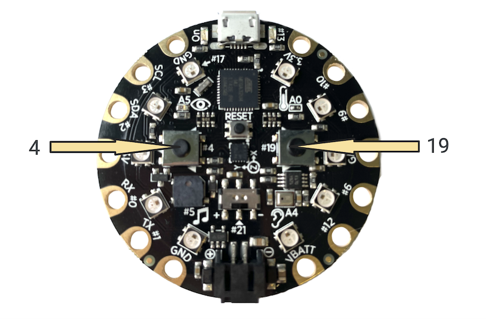

## Overview
At this point in the *Friend-O-Meter* project, we have:
- Created a light pattern for the LEDs on the physical device
- Created three functions for three categories of capacitive touch using the touch sensors
- Created conditionals that will run the three functions based on the value of the sensor
- Coded the NeoPixels to display the sensor reading in a meaningful way.

In this section, we will finish the *Friend-O-Meter* project by:
- Creating a reset function to run the light pattern and reset the NeoPixels when buttons are pressed
- Coding a function that plays music and adding that function to the reset function

## Push Buttons
There are two push buttons on the Circuit Playground: one at pin *4* and one at pin *19*.

## Digital Input

## Reset Function
- Run light pattern
- Clear NeoPixels

## Buttons Initiate Reset Function
