## Subject
CS

## Grade Level
4/5    

## Established Goal(s)/Target(s)
-	Students will be able to understand and explain the need for encryption.
-	Students will be able to design and develop an encryption system.
-	Students will be able to encrypt information using their encryption system.
-	Students will be able to use functions and sequences to program an encrypted message.

## Montana Standards
- <u>CS.AP.4.1</u> compare and refine multiple algorithms for the same task and determine which is the most appropriate.
- <u>CS.AP.4.2</u> break down problems into smaller, manageable subproblems to facilitate the program development process.
- <u>CS.AP.5.1</u> compare and refine multiple algorithms for the same task and determine which is the most appropriate.
- <u>CS.AP.5.2</u> create programs that use variables to store and modify data.
- <u>CS.AP.5.3</u> create programs that include sequences, events, loops, and conditionals.
- <u>CS.AP.5.4</u> modify, remix, or incorporate portions of an existing program to develop something new or add more advanced features.
- <u>CS.AP.5.5</u> describe choices made during program development.
- <u>CS.AP.4.3</u> test and debug a program or algorithm to ensure it runs as intended.
- <u>CS.NI.4</u> each student will identify cybersecurity problems.
- <u>CS.NI.5.1</u> explain cybersecurity problems.
- <u>CS.NI.5.2</u> explain how personal information can be protected.

## Evidence of Learning
-	Students can successfully articulate the need for encryption.
-	Students can design and develop an encryption system.
-	Students can encrypt information using mathematical processes.
-	Students can use functions and sequences to program an encrypted message.

## Prep
Teachers should complete the following preparation for the lesson:

- Make copies of [Program an Encrypted Message](../resources/4-2_program-name.pdf), [Setup the Encryption Project](../resources/4-2_setup-encryption.pdf), and [Starter Code Scaffold](../resources/4-2_starter-code-scaffold.pdf) handouts (1/student).
- Send students the link to the [starter code](https://makecode.com/_DDPCfx2apC9H).
- Make sure computers are functional and [MakeCode](https://makecode.adafruit.com/) is not blocked.
- Prepare supplies as a kit per student (1 CPX, 4 alligator clips).
- Pair students in same pairs as Ledger Project.

## Vocabulary
Term | Definition
-- | --
**Encryption**  |  a method of securing information using one or more mathematical techniques.
**Decryption**  |  a method of converting ciphertext back to plaintext; using a “key” to uncover the original message in an encrypted message.
**Plaintext**  |  information that can be directly read by a human or machine. The unencrypted text.
**Ciphertext**  |  information that has been encrypted.
**Cracking**  |  a method of attempting to convert ciphertext to plaintext without the use of a key.

## Lesson Guide

### The Need for Encryption (20 minutes)
Think-Pair-Share
```
What kind of information do people keep secret? How could you keep that information secret?
```
During discussion, bring out the need to keep some information hidden from others – like health records, financial records, and matters of national security.

Teacher explains that sending information through a wire allows us to communicate via phone and the internet. But how do we keep information secure? Anybody can tap into a line and “listen” to the content that we send across the internet. How do we keep things like passwords, credit card information, addresses, and secrets secure? We do so through encryption, which is a mathematical process to change information.

The earliest encryption technique that we know of comes from ancient Rome – the Caesar shift. The Caesar shift starts at a letter (like A) and shifts three to the right. If you start counting three to the right of A, you get D. So, A would be encoded as D. What would Y become? We start one to the right of Y, and then circle back to A and keep going. The shift wheel below shows a right shift of three for all letters.
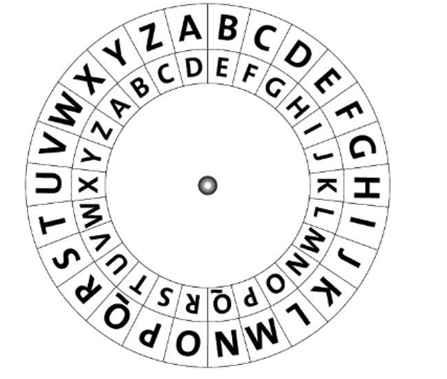

**Plaintext** is the message we want to send. **Ciphertext** is the secret message. For example, if I want to send the plaintext message HELLO, then just add three to each letter to get the ciphertext: KHOOR.
Here is another example:
```
Plaintext:  THE QUICK BROWN FOX JUMPS OVER THE LAZY DOG
Ciphertext: QEB NRFZH YOLTK CLU GRJMP LSBO QEB IXWV ALD
```
Turning plaintext into ciphertext is called **encryption**. To send the ciphertext back to plaintext, or to **decrypt** the message, we just need to go backwards three.

Choose three students to act as three characters (Alice, Bob, Eve):
```
Alice wants to send the plaintext message “Hello” to Bob. But Eve wants
to intercept the message. Neither Alice nor Bob wants Eve to get the message.
So, Alice uses the Caesar shift and encrypts the plaintext message to the
ciphertext “KHOOR.” Eve intercepts the message but has no idea how to decipher
it. But Bob knows exactly what to do because Alice and Bob agreed ahead of
time. Bob “subtracts” three and gets “Hello.”
```

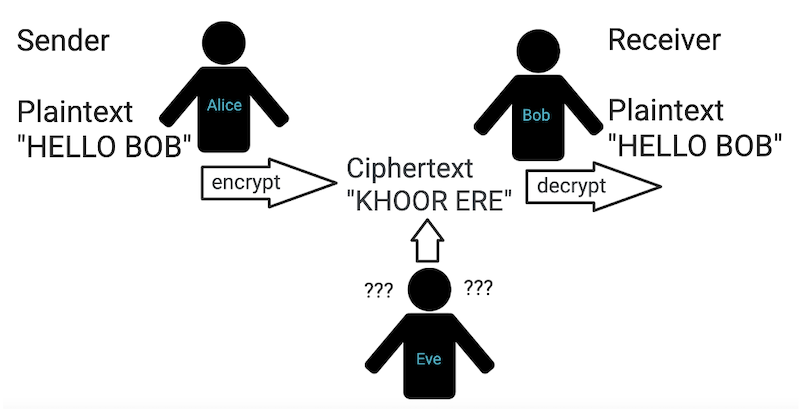

Tell students that they are going to turn their 5-bit Communication Protocol from [4-1](./4-1.md) into an encryption technique for a message they want to send on top of their ledger project using Neopixels. But first, we need to learn how to use Neopixels.

### Neopixels Lesson (15 minutes)
Teacher gives pairs of students (same pairs as the Ledger Project) the link to the starter code. This code is exactly what students are going to write for their own projects. In the starter code, A is 1, B is 2, and C is 3. The purpose of this part of the lesson is for students to understand what this starter code does so that they can replicate it in their own projects using their protocol. Pass out [Starter Code Scaffold](../resources/4-2_starter-code-scaffold.pdf) to each student so that students can follow along and make notes as the teacher explains each part of the code.

Direct students to Part 1 of *Starter Code Scaffold*. Instruct students to click *edit*. Let students use the simulator play button on the left to see what it does. Invite students to click on *Show console simulator*. They will see the letters appear with the lights. If they click *Go back* then they will see the code again.

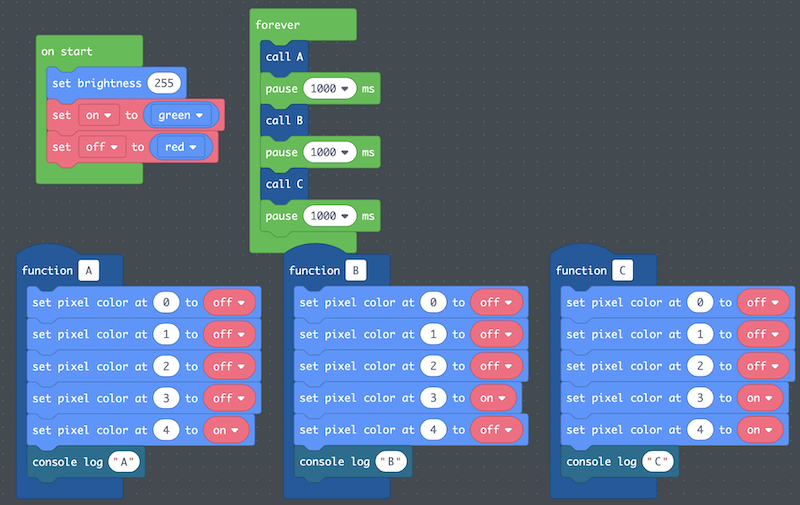

On an overhead, show students where the Neopixel blocks are (the Light menu). Explain that Neopixels are different from the LEDs we used before – with Neopixels, we can change their brightness (a scale from 0 to 255) and we can change their color. We want to change their brightness to maximum brightness (255) right when we start the program. Luckily, there is a block for the beginning of a program that only runs once called on start and it is located in the Loops menu.

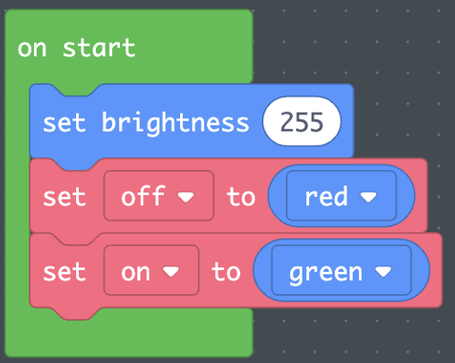

Show students the *on start* block in LOOPS. When we start the code, we set the Neopixel brightness to 255. The *set brightness* block is located in the LIGHT menu.

Direct students to Part 2 of *Starter Code Scaffold*. Ask students to change the brightness to 0 and see what happens. Then change brightness to 125 and see what happens. Give students time to write down their responses to Part 2. After, as a group, ask students what they noticed. *Note: In the simulator, it is a little difficult to see the difference between brightness 125 and brightness 255. But brightness 0 will show no color since there is no light.*

Direct students’ attention to the functions *A*, *B*, and *C*. There are 10 Neopixels on the CPX. How do we know which is which? They are numbered 0-9. In the LIGHT menu, there is a block that allows us to change the color of Neopixels called *set pixel color at ___ to ___*. The first blank is where we put the number of the Neopixel (0-9). The second blank is the color we want. For example, the code

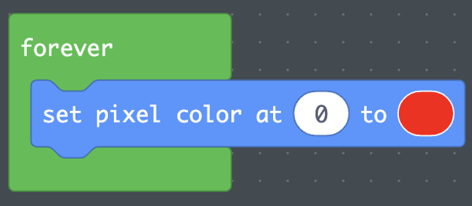

sets the Neopixel at position 0 to the color red.

We could assign a color each time we call this block, but what if we want to change the colors at some point? Instead, we can create **variables** in the *on start* section of the code. Variables are not like the ones in math – these variables just store information. In the *on start*, show students that we created two variables: *on* and *off*. Variable names should be descriptive and give insight into what they represent. To create a 5-bit number using lights, we are going to need five Neopixels. Some will be on and some will be off. So, *on* and *off* are good variable names.

To create a variable, click on VARIABLES. Then click *Make a Variable* and enter a name for the variable.

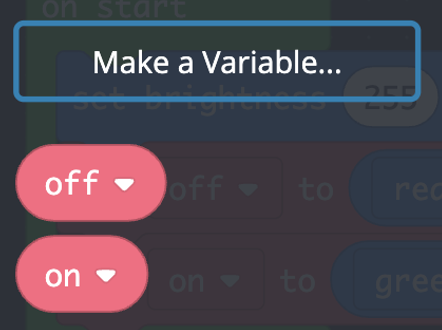

To set a variable, we use the *set ___ to ___* block in VARIABLES. The first blank is for the variable name, and it will be a scroll down menu with all the variables defined. The second block is whatever you want it to be. Here, we will set our on and off variables to represent colors. For example, the code


sets the variable *off* to *red* and the variable *on* to *green*.

Direct students back to the on start block. We set on to green and off to red. But students can decide any color they want. Direct students to Part 3 of *Starter Code Scaffold*. Instruct students to change the colors as noted in the scaffold and write down what happens in the table on the right. Tell students that in their program, they can choose whatever colors they want.

At the bottom of each function, there is a console log block. Tell students that this code is used to help us debug and understand where we are in the code. That block can be found in the Console menu. console log just prints out information that can help us understand what the code is doing. For example,

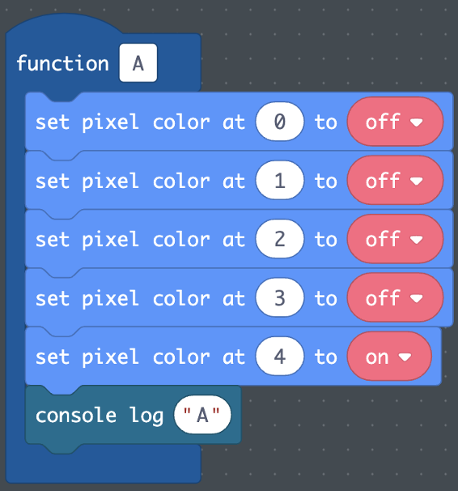

prints out “A” when the *A* function is called. In the console log, this appears as:


Direct students to Part 4 of *Starter Code Scaffold*. Instruct students to change the console log messages as shown and write down what happens. After, invite students to share out with the class.

### Code Storyboarding (15 minutes)
Tell the students that they are going to code the Neopixels to represent encrypted letters in a message they want to secretly send, as shown in the starter code. The secret message they send should relate to the visual narrative of their Ledger Project. For example, they could encode an emotion they felt during the experience or even their name. The message should not be longer than 7 letters – keep it short!

During the last class we mapped letters to decimal numbers and binary numbers. Invite students to take out the *5-Bit Communication Protocol* from the last lesson. We will use 5-bit binary numbers to represent the letters of our message. To do this, we will use the five Neopixels on the left side of the board to represent the 5 bits in the binary number, as shown below.


For example, if a student mapped M to the number 13, then that would look like:

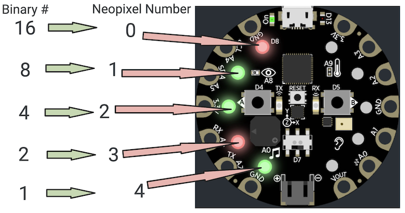

Since 13 (DEC) = 01101 (BIN). You would need to turn on the 8 card, 4 card, and 1 card, which are represented by pins 1, 2, and 4.

Pass out the [Program an Encrypted Message](../resources/4-2_program-name.pdf) handout to each student.

On the board, go through the steps of encrypting A using A=1 as the communication protocol.

First, remind students how to use the cards to convert 1 to binary:
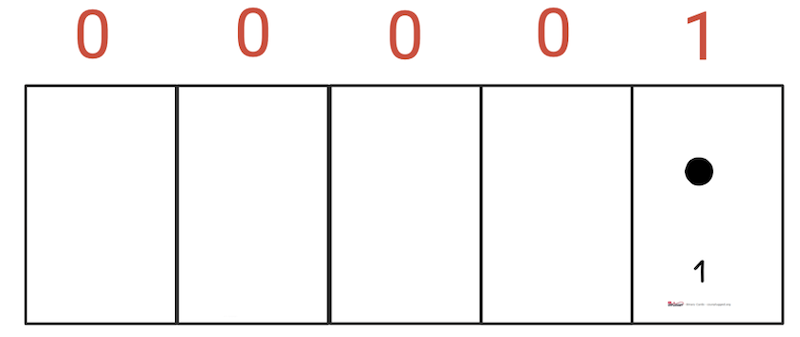

Next, show how the binary number 00001 maps to the Neopixel positions:
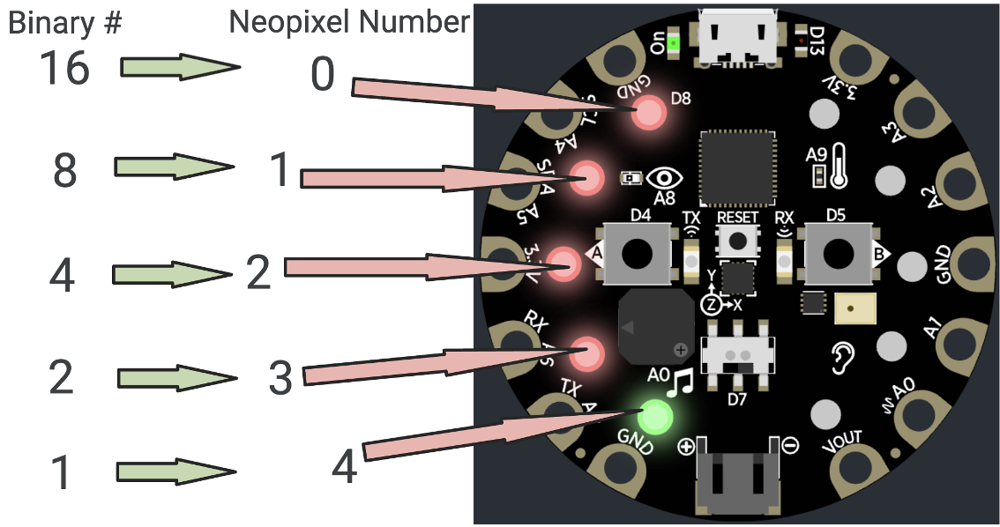

Finally, write out what needs to happen to each Neopixel and how to code it:
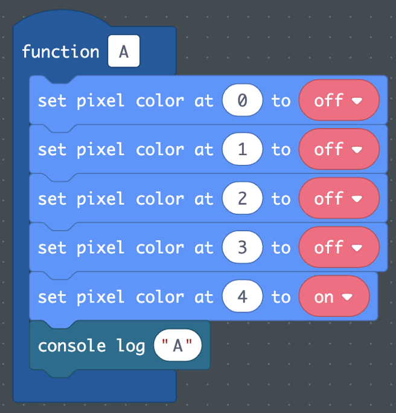

In pairs, students will use their 5-Bit communication protocol to convert the binary numbers in their protocol to code. They should discuss and create a plan, and then individually fill out the sheet. The best practice would be for students to use their name (since that was already done in the last class) or an emotion the felt during the experience they represented in their Ledger Project.

Walk around and support groups.

### Homework
Finish storyboard individually.

### Pair Programming (40 mins)
Pass out [Setup the Encryption Project](../resources/setup-encryption.pdf) handout to each student.

Put students in the same pairs as the Ledger Project, allow pairs to access a single computer, and have students go to [MakeCode](http://makecode.adafruit.com). Be sure to have the student who made the Ledger Project sign into their account.

Direct students to Part 1 of *Setup the Encryption Project* handout. Run through the directions on the handout step by step, giving students time to complete each step:
- Go to *MakeCode* and click *My Projects* on the left, above the *New Projects* button.
- Find your Ledger Art Project and click the circle in the top right corner so that the green check appears. Then click *Duplicate* in the top right corner. This will copy your Ledger Project so that any changes you make will not impact your past work.
- Name your new project *Encryption Project*.
- Click on the new *Encryption Project* so that the green check appears. Click *Open* in the top right corner of the screen.

There are three parts to the code of this project:
- **On Start**, where we initialize the *on* and *off* variables to the colors we want and set the brightness to 255.
- **Functions**, where we define the Neopixel encryption for each letter
- **Forever**, where we call the letter functions every one second.

Unlike the Ledger Project, where we programmed the pins of two separate circuits from one computer, we cannot code the Neopixels of a single CPX in two different ways. This means that pairs will have to code their own private message on their separate accounts. Out of the three parts to the code, *On Start* and *Functions* are common to the two students; the only thing that differs is the *Forever* loop.

This activity will start as Pair Programming, where pairs will complete the code that will be shared between their projects (*On Start* and *Functions*) on one partner’s account (driver 1). Then they will share the collaborative starter that contains *On Start* and *Functions* with the other partner (driver 2), and the students will add the *Forever* loop to their individual project. Adding the *Forever* loop should be very quick, as it is just spelling out the message with a one second pause between letters. This is all scaffolded in the Setup the *Encryption Project* handout.

Direct students to Part 2 of *Setup the Encryption Project*. Remind students of the driver and navigator roles. Whoever’s account was used to duplicate the Ledger Project code to setup the Encryption Project should be Driver 1. Driver 1 will start as the Driver for *On Start*, then they will switch for the first function and continue switching for each letter they need to write.

After each letter, students should test the function by calling it in a *Forever* loop and using the *Play* button on the CPX simulator to make sure it works as intended.

### Share (10 mins)
Gallery walk
