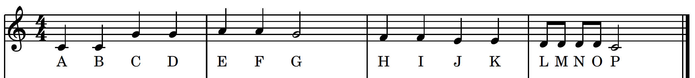

## Overview

## Buzzer

## Frequency and Duration
A note is a sound that is defined by a certain pitch (**frequency**), and we play the note for a certain time interval (**duration**).

### Frequency
In Western music, we use 12 semitones on a chromatic scale. If you were to look at a piano, each piano key is a different note. The white keys are the notes **C**, **D**, **E**, **F**, **G**, **A**, **B**, and the black keys are sharps **#** (a half tone above the white key to the left) and flats **b** (a half tone below the white key to the right). Groups of notes from C to B are defined as an octave. A C in octave 3 is lower than a C in octave 4 which is lower than a C in octave 5.

[](https://pixabay.com/vectors/piano-keys-octave-music-keyboard-307653/)

All Western music uses these notes in some combination. So how do we turn these notes into code that can be used to play the note on the buzzer? Like colored light, where different frequencies produce different colors, different frequencies of sound produce different notes. Below you will find the frequency values (in Hertz) for all the notes in octave 3 through octave 5. We are using these three octaves because anything beyond those octaves will not register on the small buzzer.

Note | Octave 3 | Octave 4 | Octave 5 |
:---: | :---: | :---: | :---: | :---: | :---:
**C**  |  130.81 | 261.63  | 523.25
**C#/Db**  | 138.59  | 277.18  |  554.37  
**D**  | 146.83  | 293.66  |  587.33
**D#/Eb**  | 155.56  | 311.13  | 622.25   
**E**  | 164.81  | 329.63  |  659.25
**F**  | 174.61  | 349.23  | 698.46  
**F#/Gb**  | 185  | 369.99  | 739.99   
**G**  | 196  | 392  | 783.99  
**G#/Ab**  | 207.65  | 415.3  | 830.61  
**A**  | 220  | 440  | 880  
**A#/Bb**  | 233.08  | 466.16  |  932.33  
**B**  | 246.94  | 493.88  |  987.77

### Duration
In sheet music, we have symbols that represent how long to play each note. We represent note lengths in terms of **whole**, **half**, **quarter**, and **eighth** notes.

[](https://commons.wikimedia.org/wiki/File:Divisive_rhythm.png)

A whole note is sustained for the longest amount of time. There are two half notes for every whole note. There are two quarter notes for every half note, and there are 2 eighth notes for every quarter note. In other words, if a whole note is worth 800 milliseconds, then a half note would be 400 milliseconds, a quarter note would be 200 milliseconds, and an eighth note would be 100 milliseconds.

For example, if we wanted to play The Alphabet Song, stopping at P, then the list of notes with their durations might look like this:



**Note** | C | C | G | G | A | A | G
**Duration** | quarter | quarter | quarter | quarter | quarter | quarter | half
**Note** | F | F | E | E | D | D | D | D | C
**Duration** |  quarter | quarter | quarter | quarter | eighth | eighth | eighth | eighth | half

**Task** Use the [virtual piano](https://www.musicca.com/piano) to create a fun sequence of notes, where each note as a given duration (whole, half, quarter, eighth). If you can read music and would like to convert a melody from sheet music, go for it!
Use the table below to write down each note in order and for how long it will play.

**Note** | | | | | | | | | | | | | | | |
**Duration** | | | | | | | | | | | | | | | |

## Arrays
Arrays are data structures that can hold multiple variables in a list-like structure. For example, here is the declaration and initialization of an array:

```
int numbers[] = {2, 5, 9, 3, 4};
```

This array has the size 5 because there are 5 numbers in the array. To get the number of elements in the array, we can write the code:

```
sizeof(numbers);
```

*numbers* is the reference for the space in the memory that stores the array.

### Accessing Elements of an Array
If we want to get the numbers in the array, we need to know where the numbers are located in the array. We use indices to determine the positions of elements in an array. Indices begin at *0* and end at *sizeof(<array name>) - 1*. In *numbers*, there are 5 elements, but the indices start at *0* and end at *4*.

If we call

```
numbers[0];
```

we would get the number 2 since that is the 0th element. Likewise, calling

```
numbers[4]
```

would yield 4 since that is the element at index 4.

### Iterating Through an Array
If we wanted to print all numbers in the array to the Serial Monitor, we could do so by iterating through each index of the array in a *for loop*. The code would look like this:

```
for(int i = 0; i < sizeof(numbers); i++) {
  Serial.println( numbers[i] );
}
```

This code would start at *i = 0* (index 0) and loop through *i = 4* (index 4). For each index, the code would print the element of the array at that index.

### Example Music
We are going to need to create an array for the frequencies as well as the durations of each note. We will then iterate through each array and play the tone for that length.

On an Arduino, the *CircuitPlayground* library has a function called *playTone*. For example,

```
CircuitPlayground.playTone(440, 1000);
```

would play the 440 Hz (A) frequency for 1000 milliseconds. In order to invoke the *playTone* function, we need to include the *CircuitPlayground* library and initialize the library in the *setup*. We have provided some sample code for playing the first part of The Alphabet Song described above in code:

```
//Import Statements
#include <Adafruit_CircuitPlayground.h>

//Part 1
int whole = 1000;
int half = .5 * whole;
int quarter = .5 * half;
int eighth = .5 * quarter;

//Part 2
void setup() {
  CircuitPlayground.begin();
}

//Part 3
void loop() {
  double notes[] = {261.63, 261.63, 392, 392, 440, 440, 392, 349.23, 349.23, 329.63, 329.63, 293.66, 293.66, 293.66, 293.66, 261.63};
  int durations[] = {quarter, quarter, quarter, quarter, quarter, quarter, half, quarter, quarter, quarter, quarter, eighth, eighth, eighth, eighth, half};
  for(int i = 0; i < sizeof(notes); i++) {
    double note = notes[i];
    int duration = durations[i];
    CircuitPlayground.playTone(note, duration);
  }
}
```

Lets go through the code part by part.

In **Import Statements**, we include the *CircuitPlayground* library.

In **Part 1**, we declare an integer called *whole* and set it to 1000 millisecond. Because half notes are half of whole notes and quarter notes are half of half notes and so on, all we needed to do was declare a value for the whole note, and we set each subsequent duration value to *.5* times the value before it. This gives us two benefits:
- By changing the value of *whole*, we therefore change each smaller value.
- When we use these duration values in our code, we can just call the name of the variable to make the code easier to read.

In **Part 2**, we initialize the *CircuitPlayground* library.

In **Part 3**, we declare two arrays: one for the frequencies called *notes*, and one for the durations called *durations*. In the *notes* array, we listed the frequency of the note we needed in order using the frequency chart above. In duration, we listed the duration value of each note. We then use a *for loop* to loop from index 0 to the size of the array (it doesn't matter which array we use since both arrays have the same size). We get the value of the current note (*notes[i]*) and the value of the current duration (*duration[i]*). We then use the *playTone* function in the *CircuitPlayground* library to play the *tones[i]* tone for the *duration[i]* duration. The *for loop* will run through each note and duration sequentially to produce the melody.

### Your Turn
**Task* 
