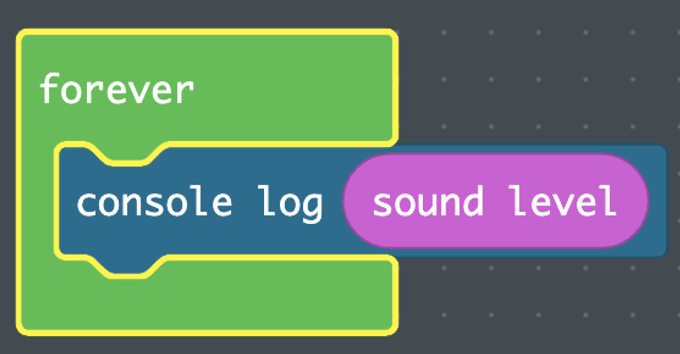

## Overview

| ---: | :--- |
| **Subject** | CS, IEFA |
| **Grade Level** | 4-6 |
| **Duration**  | 50 minutes  |
|   |   |

## Established Goal(s)/Target(s)
-	Students will be able to identify and discuss the ways stories can confirm or deny identity.
-	Students will be able to use sensor data to discuss how people interact with technology differently.

## Content Standards
- **IEFA Essential Understandings**
  - *EU 6 (History from Indian Perspectives)* History is a story most often related through the subjective experience of the teller. With the inclusion of more and varied voices, histories are being rediscovered and revised. Histories told from American Indian perspectives frequently conflict with the stories mainstream historians tell.
- **Computer Science Standards**
  - *CS.DA.4.1* select and use appropriate nondigital and digital tools to collect and represent data.
  - *CS.DA.4.2* identify and use multiple types of data to complete a task.
  - *CS.DA.4.3* evaluate the validity of data based on accuracy and relevance.
  - *CS.IC.4.1* collect diverse perspectives for the purpose of improving computational artifacts.
  - *CS.DA.5.3* use accurate and relevant data to highlight or propose cause-and-effect relationships, predict outcomes, or communicate an idea.
  - *CS.CS.5.2* model how computer hardware and software work together as a system to accomplish tasks.
  - *CS.IC.5.2* identify ways to improve the accessibility and usability of technology products for the diverse needs and wants of users.
  - *CS.IC.5.3* utilize diverse perspectives for the purpose of improving computational artifacts.
  - *CS.CS.6-8.1* recommend improvements to the design of computing devices, based on an analysis of how users interact with the devices.
  - *CS.CS.6-8.2* design projects that combine hardware and software components to collect and exchange data. 

## Prep
Teachers should complete the following preparation for the lesson:

- Make copies of [Testing the Sound Sensor](../resources/5-2_sound-sensor.pdf) for students (1/pair).
- Prepare supplies as a kit per student (1 CPX, 4 alligator clips, 1 USB).
- Ensure [MakeCode](https://makecode.adafruit.com/) can run on computers.
- <span class="todo">Add a scaffold for posters</span>

## Vocabulary
The following are terms used in this lesson.

Term | Definition
---: | --
**Human-Computer Interaction**  |  a field of study focused on the design of technology, specifically the interactions between humans and computers.
**Sensor**  |  a device which detects or measures a physical property and records, indicates, or otherwise responds to it.
**Data**  |  the quantities, characters, or symbols on which operations are performed by a computer, being stored and transmitted in the form of electrical signals, and recorded.
**Variable**  |  stores information to be referenced or manipulated in a computer program.

## Lesson Guide

### Intro (10 mins)
Think-Pair-Share
```
How does telling stories impact how we see ourselves?  

What if you were not allowed to tell your stories?  

Are the stories you tell about yourself the same as stories others tell about you?  

Why do you think the stories of American Indians are not as present in your
education as European settlers?
```
Transition to the lesson by remarking on how we have used LEDs to tell our stories and encryption to decide who gets to hear our stories. Telling our own stories is important – telling our own stories gives us the ability to forge our paths and take ownership of our own destinies – much like the symbolism of the Blackfeet on the train in Terrance Guardipee’s contemporary ledger art that we analyzed earlier in [1-2](./1-2.md). Telling our own stories gives us power over how others see us.

But so far, we have not been able to interact with those stories using human interactions. How do we interact with technology as humans to share our stories? Is there a way we can use what makes us human to interact with technology?

### Human-Computer Interaction (5 mins)
Think-Pair-Share
```
What are all the ways in which you interact with the devices you use?  
List as many as possible.
```
Bring the conversation to human interactions – using voice, touch, proximity, movement, etc. to interact with a computing device.

Explain to students that **human-computer interaction** is a field of study focused on the design of technology, specifically the interactions between humans and computers.

Tell students that currently, the light patterns on their ledger art projects operate immediately when connected to a power source. In this lesson, we are going to learn how to make the ledger project turn on by using our voices. In this way, when students tell their stories orally, they will activate their projects. But first, we need to learn how to make the CPX recognize voice.

### Set Up the Data Activity (15 mins)
Place students in the same pairs as the Ledger Project.

Invite students to get supplies from kit.

Pass out [Testing the Sound Sensor](../resources/5-2_sound-sensor.pdf).

Read numbers 1-4 from the handout out loud and show students where everything is in MakeCode:

Choose one partner to log in to MakeCode, and create a new project.

The Circuit Playground Express has a sound sensor that calculates the amount of sound entering it. A lot of factors could influence the readings of the sensor, and we are going to do some tests to determine the best way to turn on your Ledger Project by telling the story that inspired it.

We want to print out the current sound level being read by the Circuit Playground Express. In words, “forever, print out the sound level.”



| Block | Location | What It Does |
| :---: |  :----:  |     :---:    |
|    | LOOPS  | The blocks inside a forever loop while run over and over as long as the circuit is plugged into a power source.  |
|  | ADVANCED --> CONSOLE  | Prints out whatever is in the empty space in the Serial Monitor.  |
|  | INPUT | A variable that stores the current sound level being read by the sound sensor on the Circuit Playground Express. |

Plug in the Circuit Playground Express, click the *play* button in *MakeCode*, and click *Show Console Simulator*.


You should see numbers on the screen. Those numbers represent the current amount of sound being read by the sensor. Try talking and blowing into the sensor. If the numbers are not changing, contact your teacher.

Walk around and support pairs that may be struggling.

### Gather Data (20 mins)
Read the top of page two of *Testing the Sound Sensor* with students:
```
In this activity, you will test the sound sensor and record your data.
There are two measures you are going to collect: distance from the sensor
and the person talking. We are going to determine if there are differences
in the sound level if someone is closer and further away from the sensor
as well as if there are differences in who is speaking. You and five classmates
are going to test your sensor at three different distances from the sensor:
next to your mouth, the distance you would normally talk to someone, and far
away. Stand at three different distances from the sensor. You are going to
record the lowest number and highest number you get at each of the three positions.
```
Model the three positions that students should use to test the sensor.

Tell students to leave their data chart on the table with the Serial Monitor open so the numbers are running. Students will fill out the chart themselves and then find five more students to test the sensor. As students fill out each other’s sensors, they should write their data on their peers’ charts.

### Homework
Students fill out the questions below the chart. You will start with a discussion based on those questions during the next class.
```
Did each person have the same values?  

If no, why might each person have different numbers?  

If you were creating a device with voice activation like Alexa or Siri,
what would you think about when designing for every person in the world?

```
