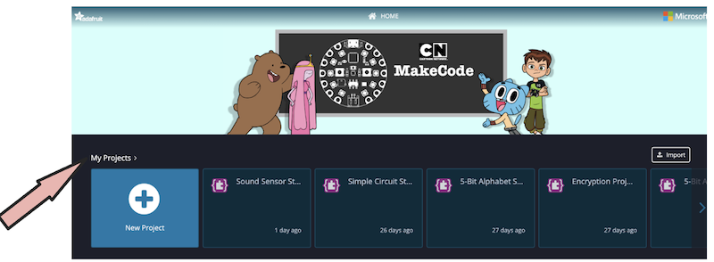
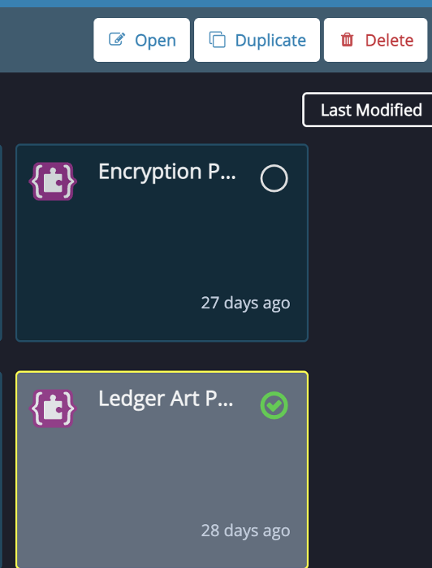
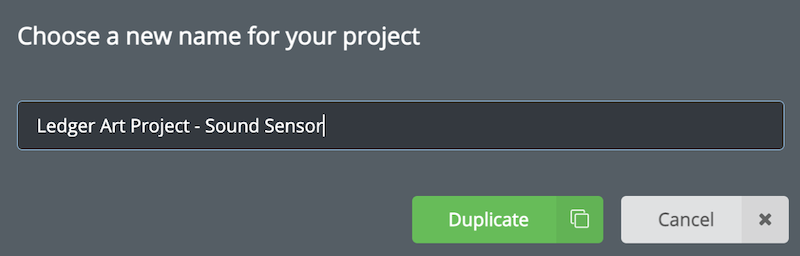
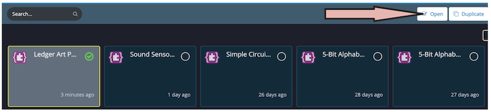
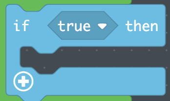
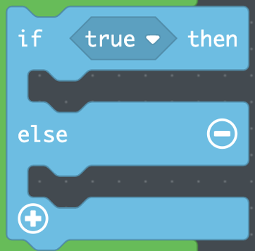

## Subject/Course
CS

## Grade Level
4/5    

## Established Goal(s)/Target(s)
-	Students will be able to identify and discuss the need to consider diversity when designing technology.
-	Students will be able to program a computational artifact to interface with human voices.

## Montana Standards
- CS.IC.4.1 collect diverse perspectives for the purpose of improving computational artifacts
- CS.IC.4.3 describe ethical issues that relate to computing devices and networks.
- CS.IC.5.2 identify ways to improve the accessibility and usability of technology products for the diverse needs and wants of users.
- CS.IC.5.3 utilize diverse perspectives for the purpose of improving computational artifacts.
- CS.IC.5.5 describe ethical issues that relate to computing devices and networks.
- CS.AP.4.2 break down problems into smaller, manageable subproblems to facilitate the program development process.
- CS.AP.4.3 test and debug a program or algorithm to ensure it runs as intended.
- CS.AP.5.2 create programs that use variables to store and modify data.
- CS.AP.5.3 create programs that include sequences, events, loops, and conditionals.
- CS.AP.5.4 modify, remix, or incorporate portions of an existing program to develop something new or add more advanced features.
- CS.AP.5.5 describe choices made during program development.

## Evidence of Learning
- Students can participate in discussions of the need for inclusive design for technologies.
- Students can use collected data to design computational artifacts for diverse users.
- Students can use conditionals to program a sensor to react to human feedback.

## Prep
Teachers should complete the following preparation for the lesson:

- Make copies of [Ledger Art Storytelling](../resources/5-3_ledger-art-storytelling.pdf) handout (1/student).
- Have first Think-Pair-Share written on board for students.
- Prepare supplies as a kit per student (1 CPX, 4 alligator clips, 1 USB).
- Ensure [MakeCode](https://makecode.adafruit.com/) can run on computers.

## Vocabulary
Conditional
: code that handles decision-making.

Comparison Operator
: mathematical operator that compares two values and returns true or false.

## Lesson Guide

### Inclusive Design Discussion (10 mins)
Explain that the goal of this project is to activate the light patterns of the Ledger Art Project using our voice in order to tell the story that inspired the design.

Think-Pair-Share
```
Based on your experience collecting data in the last class, what sound level value
do you think will be sufficient to turn on your lights when telling your story out loud?

Are you thinking about yourself or are you thinking about everyone who tested your sound sensor?

What might be some challenges you face if you set the sound level too low?
```
During the class share, if students do not raise the issue, ask out if there could there be some students with quiet voices or those who cannot speak who would not be able to tell their story using your project and how they would design for those students.

### Pair Programming (30 mins)
Pass out [Ledger Art Storytelling](../resources/5-3_ledger-art-storytelling.pdf) handout to each student.

Go through page one of handout step by step with students:

Choose a partner that has the code for the Ledger Art Project saved in their account and log in to *MakeCode*.

#### Duplicate Your Ledger Art Project Code
At your account home screen, click on *My Projects*.



Click on your Ledger Art Project so that the green check appears and click *Duplicate*.



Rename the new project *Ledger Art Project – Sound Sensor* and click *Duplicate*.



Click the new project that appears so that the green check mark appears and click *Open*.



Read top of page 2 of handout:
```
The goal for this project is to make the light patterns work when you tell the
story of your project. In other words, when the sound level of your voice is at
a certain level, you want to call the light pattern.
```
Invite students to write down the step-by-step account of needs to happen in their code. There is an example on the handout for scaffolding. Explain that if the lights are already on, and you want them to turn off, then a computer needs to be told explicitly that they need to be turned off. Invite students to share their pseudocode. Give feedback as necessary to point the class in the right direction. Note: This logic is where students will get hung up so make sure to scaffold the discussion by writing on the board and being clear about the need to explicitly turn the LEDs off if you do not want them on.

Direct students to the code blocks they might need in this project on the handout. Explain that we can make decisions in code using **conditional statements**. Give some examples of conditional statements:
```
If it is raining, then I will bring an umbrella.  
If I get an A on a test, then I will feel pride in my work.  
If I am 16 years old or over, then I can drive.
```
Direct students to the *if ___ then ____* block in the LOGIC menu of *MakeCode*.



Explain that sometimes, we want something to happen if the value is not true. Direct students to the *if ___ then __ else ___* block in the LOGIC menu.



For example, if I am 16 years old or older, then I can drive. Else (I am younger than 16), I cannot drive. In this instance, we create a condition for those who do not meet the first condition using a catch-all: else.

Write the following on the board:
```
If the sound level is over 500, run my light pattern. Else, turn the LEDs off.
```
Ask students what *else* would mean in this context.

In the last example, our condition was that the sound level is over 500. This is called a **mathematical operator**, and it is either true or false. For example, 400 > 500 is false. And 600 > 500 is true. 500 > 500 is false. Direct students to the *___ > ___* block in the LOGIC menu and explain that we can drag that block over *true* next to if in the conditional blocks.


Give students time to code their projects. Clarify that they only need to change the code in the *Forever* loops. Remind students of pilot/navigator pair programming. Students should pilot their own code.

Walk around and support pairs.

### 3.	Share (15 mins)
Group two sets of partners together next to their computers.

Tell students that with the CPX plugged in, they should tell the story that inspired their Ledger Art Project. As they tell their stories, the light patterns should turn on.

Students switch until all four have shared their story.
